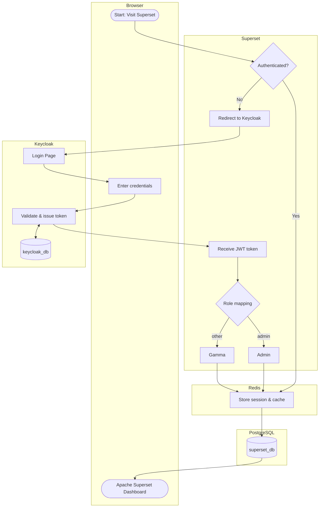

# Data and Knowledge Administration Console

!!! component-header "Info"
    **Current version:** 1.0.2

    **Technology:** Apache Superset

    **Project repository:** [SoilWise Superset](https://github.com/soilwise-he/soilwise-superset)

    **Release:** <https://doi.org/10.5281/zenodo.19567030>

    **Access point:** <https://superset.soilwise.wetransform.eu/superset/dashboard/p/P52OgRVBGo9/>

## Introduction

### Overview & Scope

The Data and Knowledge Administration Console is compiled of several dashboard pages implemented using Apache Superset technology. Apache Superset is an open-source data exploration and visualization platform that enables to create interactive, web-based dashboards with minimal coding. The official documentation is available [here](https://superset.apache.org/user-docs/). In SoilWise it is used to present statistics from the [SoilWise Finder](catalogue.md), results of the [Metadata Validation](metadata_validation.md) and to provide more insights into the results published by Mission Soil projects. The console is available only for authorised users.

### Intended Audience

- **SWC Administrator** monitoring the contents of the SoilWise Catalogue
- **Mission Soil Projects Monitoring officer** monitoring the results published by Mission Soil projects
- **JRC data analysts** monitoring the metadata quality of published soil-related datasets.

### Key Features

1. **Rich visualisation possibilities** different kinds of charts, tables and so on.
2. **Intuitive SQL editor** for querying data sources and preparation of data for visualisation.
3. **Role-based access control** for managing access rights. Currently two roles are distinguished: (1) **Admin role** for access to Superset Dashboard, datasets and charts configurations and role management. (2) **Gamma role** is assigned to users, who are allowed to view configured dashboards.
4. **Redis** is used to cache data.
5. **WYSIWYG editor** for configuring the content and layout of dashboard pages. Currently three pages are designed:
    - **Homepage** used to display the general overview of Catalogue content using various charts and filters.
    - **Validation Results** used to display the results of [INSPIRE Metadata validation](metadata_validation.md).
    - **Mission Soil Projects** used to display more detailed insights into data and knowledge published by Mission Soil projects, that is available in SoilWise.

## Architecture

### Technological Stack

|Technology|Description|
|----------|-----------|
| **Apache Superset**|Used for configuration and display of the dashboard pages compiling the Console.|
| **Keycloak**|Used for user management and access rigths.|
| **PostgreSQL**|Connection to a DB with Catalogue contents and validation results.|
| **Redis**| The connection to Redis is used to store Superset sessions and cache data for faster performance. |

### Main Components Diagram

The following diagram illustrates the integration of Keycloak with Apache Superset Dashboard.

