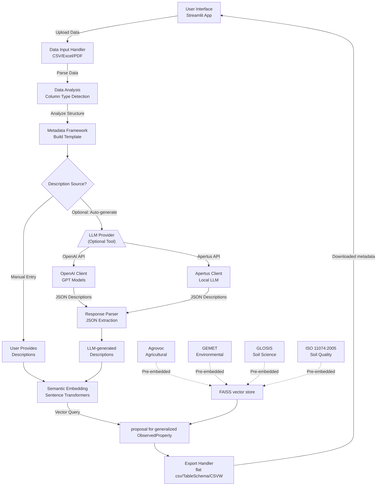

# Data publication support

## Introduction
### Overview and Scope

At the moment, SoilWise supports data publishers with the following tools:

- [DOI Resolution Widget](#doi-resolution-widget)
- [Tabular Soil Data Annotation](#tabular-soil-data-annotation) to help users create semantic metadata for tabular datasets.
- [INSPIRE Geopackage Transformation](#inspire-geopackage-transformation)
- [Soil Vocabulary Viewer](../knowledge_graph/#soil-voc-viewer), part of the Knowledge Graph component, visualizes and links different soil-domain vocabularies and terms.

## Intended Audience


## DOI Resolution Widget

!!! component-header "Info"

    **Current version:** 

    **Technology:** 

    **Project:** 

    **Access Point:** 

### Overview and Scope
### Key Features
### Architecture
#### Technological Stack
#### Main Sequence Diagram
### Integrations & Interfaces
### Key Architectural Decisions
### Risks & Limitations


## Tabular Soil Data Annotation

!!! component-header "Info"

    **Current version:** 

    **Technology:** [Streamlit](https://streamlit.io/), Python, [OpenAI API](https://openai.com/)

    **Project:** [Tabular Data Annotator](https://github.com/soilwise-he/TabularDataAnnotator-streamlit)

    **Access Point:** <https://dataannotator-swr.streamlit.app/>

### Overview and Scope

**DataAnnotator** is a Streamlit-based web application designed to help users create semantic metadata for tabular datasets. It combines optional Large Language Model (LLM) assistance with semantic embeddings to annotate data columns with machine-readable descriptions, element definitions, units, methods, and vocabulary mappings.

The tool addresses the metadata annotation workflow by:

1. **Enabling manual annotation**: Users directly enter descriptions for data columns
2. **Automating description generation** (optional): If users have context documentation, LLMs can help extract and structure descriptions automatically
3. **Linking to vocabularies**: Semantic embeddings match descriptions to controlled vocabularies for standardization

The LLM layer is optional—users can skip automated generation and manually provide descriptions, which the system will then semantically match to existing vocabulary terms.

### Key Features

| Feature | Implementation | Purpose |
|---------|----------------|---------|
| **Auto Type Detection** | Statistical sampling | Identify data patterns |
| **Manual Description Entry** | Streamlit text inputs | Direct user annotation |
| **Optional LLM Assistance** | OpenAI/Apertus integration | Auto-extract descriptions from docs |
| **Semantic Vocabulary Matching** | FAISS vector search | Link descriptions to standard vocabularies |
| **Context Awareness** | PDF/DOCX import + prompting | Extract domain-specific info when available |
| **Multi-format Export** | flat csv/TableSchema/CSVW | Integration with downstream tools |

### Architecture
#### Technological Stack

| Component | Technology |
|-----------|-----------|
|**Frontend**|Streamlit 1.51+|
|**Backend Logic**|Python 3.12+|
|**LLM Integration**|OpenAI API, Apertus HTTP|
|**Embeddings**|Sentence Transformers 5.1+|
|**Vector Search**|FAISS (CPU) 1.12+|
|**File Parsing**|PyPDF2, python-docx, openpyxl|
|**ML Libraries**|scikit-learn, NumPy|

**Dependencies & Models**

- Python Packages
    - `streamlit>=1.51.0` - Web UI framework
    - `openai>=2.7.2` - LLM API client
    - `sentence-transformers>=5.1.2` - Semantic embedding
    - `faiss-cpu>=1.12.0` - Vector similarity search
    - `pandas>=2.0` - Data manipulation
    - `openpyxl>=3.1.5` - Excel handling
    - `python-docx>=1.2.0` - Word document parsing
    - `pypdf2>=3.0.1` - PDF text extraction


- Pre-trained Models/Data
    - **Embedding Model**: `all-MiniLM-L6-v2` (384 dimensions, 22M parameters)
    - **FAISS Index**: Pre-computed vocabulary embeddings (stored in `data/` directory)

#### Main Components

**1. Data Input Module**

- **Supported Formats - Tabular Data**: CSV, Excel (XLSX)
- **Supported Formats - Context Documents**: Free-form text input, PDF documents, DOCX files
- **Processing Functions**:
    - `read_csv_with_sniffer()`: Auto-detects CSV delimiters
    - `import_metadata_from_file()`: Reads existing metadata if provided
    - `read_context_file()`: Extracts context from PDFs/DOCX for LLM-assisted annotation

**2. Data Analysis & Type Detection**

- **Function**: `detect_column_type_from_series()`
- **Detects**:
    - **String**: Text data
    - **Numeric**: Integers and floats
    - **Date**: Temporal values
- **Approach**: Statistical sampling of column values (up to 200 non-null entries)

**3. Metadata Framework**

- **Function**: `build_metadata_df_from_df()`
- **Template Fields**:
    - `name`: Column identifier
    - `datatype`: Type classification (string/numeric/date)
    - `element`: Semantic element definition
    - `unit`: Measurement unit
    - `method`: Collection/calculation method
    - `description`: Human-readable description
    - `element_uri`: Link to external vocabulary

**4. LLM Integration Layer (Optional)**

**Purpose**: Automate the extraction and structuring of descriptions from existing documentation when users have context materials.

**When to Use:**
- User has documentation (PDFs, Word docs, etc.) describing variables
- Manual annotation is time-consuming for large datasets
- Descriptions need to be extracted from unstructured text

**Supported Providers:**

1. **OpenAI (Recommended)**
    - Uses GPT models for high-quality response generation
    - `get_response_OpenAI()`: Direct API calls
    - Best for complex, domain-specific text extraction

2. **Apertus (Alternative)**
    - Self-hosted LLM option
    - `get_response_Apertus()`: HTTP-based endpoint
    - Swiss-based open-source model

**Functionality:**

- **Function**: `generate_descriptions_with_LLM()`
- **Inputs**:
    - Variable names to describe
    - Context information from documents or text input
- **Output Format**: Structured JSON with descriptions for each variable

**5. Semantic Embedding & Vocabulary Matching**

- **Model**: Sentence Transformers (default: `all-MiniLM-L6-v2`)
- **Functions**:
    - `load_sentence_model()`: Load embedding model
    - `load_vocab_indexes()`: Load pre-computed FAISS indexes
    - `embed_vocab()`: Generate embeddings with optional definition weighting
- **Purpose**: Match generated or manually-entered descriptions to controlled vocabularies

**Pre-computed Vocabulary Sources**

The FAISS vectorstore was pre-computed by embedding terms from four major public vocabularies:

| Vocabulary | Domain | Source |
|-----------|--------|--------|
| **Agrovoc** | Agricultural and food sciences | FAO - Food and Agriculture Organization |
| **GEMET** | Environmental terminology | European Environment Agency (EEA) |
| **GLOSIS** | Soil science and properties | FAO Global Soil Information System |
| **ISO 11074:2005** | Soil quality terminology | International Organization for Standardization |

This multi-vocabulary approach enables annotation of diverse datasets including agricultural, environmental, and soil-related data.

**FAISS Index Structure:**
```json
Index File: vocabCombined-{modelname}.index
Metadata File: vocabCombined-{modelname}-meta.npz

Metadata Dictionary Format:
{
    index_id: {
        "uri": "vocabulary_uri",
        "label": "preferred_label",
        "definition": "term_definition",
        "QC_label": "prefLabel|altLabel"
    },
    ...
}
```

**6. Export & Download Module**

- **Function**: `download_bytes()`
- **Supported Formats**:
    - Excel (XLSX) - for human review
    - JSON - for machine processing
    - CSV - for spreadsheet tools
- **Implementation**: Streamlit session-based download management


#### Main Sequence Diagram



### Key Architectural Decisions

**Optimization Strategies:**

1. **Model Caching**: Streamlit `@st.cache_resource` for persistent model loading
2. **API Caching**: JSON-based result memoization to avoid redundant API calls
3. **FAISS Optimization**: Pre-computed indexes for O(log n) vector search
4. **Batch Processing**: Process multiple columns in single LLM call


## INSPIRE Geopackage Transformation

!!! component-header "Info"

    **Current version:** 

    **Technology:** 

    **Project:** 

    **Access Point:** 

### Overview and Scope
### Key Features
### User Manual
### Architecture
#### Technological Stack
#### Main Sequence Diagram
#### Database Design
### Integrations & Interfaces
### Key Architectural Decisions
### Risks & Limitations

## Other recommended tools acknowledged by SoilWise community

The following components are not a product of SoilWise project, and not an integral part of the SoilWise Catalogue, but are recommended by the SoilWise community.

### Hale Studio

A proven ETL tool optimised for working with complex structured data, such as XML, relational databases, or a wide range of tabular formats. It supports all required procedures for semantic and structural transformation. It can also handle reprojection. While Hale Studio exists as a multi-platform interactive application, its capabilities can be provided through a web service with an OpenAPI.

### User Manual
A comprehensive tutorial video on [soil data harmonisation with hale studio can be found here](https://www.youtube.com/watch?v=U1lxzlUquE8&list=PLoyBfgUelhNOwA_GGkd4hSwDnwNhxGC87&index=3).

**Setting up a transformation process in hale»connect**

Complete the following steps to set up soil data transformation, validation and publication processes:

1. Log into hale»connect.
2. Create a new transformation project (or upload it).
3. Specify source and target schemas.
4. Create a theme (this is a process that describes what  should happen with the data).
5. Add a new transformation configuration. Note: Metadata generation can be configured in this step.
6. A validation process can be set up to check against conformance classes.

**Executing a transformation process**

1. Create a new dataset and select the theme of the current source data, and provide the source data file.
2. Execute the transformation process. ETF validation processes are also performed. If successful, a target dataset and the validation reports will be created.
3. View and download services will be created if required.

To create metadata (data set and service metadata), activate the corresponding button(s) when setting up the theme for the transformation process.

<!-- HERE'S FOR REFERENCE, THE PREVIOUS CONTENT
## Transformation and Harmonization

### Overview and Scope
These components make sure that data is interoperable, i.e. provided to agreed-upon formats, structures and semantics. They are used to ingest data and transform it into common standard data, e.g. in the central SWR format for soil.

The specific requirements these components have to fulfil are:

- The services shall be able to work with data that is described explicitly or implicitly with a schema. The services shall be able to load schemas expressed as XML Schemas, GML Application Schemas, RDF-S and JSON Schema.
- The services shall support GML, GeoPackage, GeoJSON, CSV, RDF and XSL formats for data sources.
- The services shall be able to connect with external download services such as WFS or OGC API, Features.
- The services shall be able to write out data in GML, GeoPackage, GeoJSON, CSV, RDF and XSL formats.
- There shall be an option to read and write data from relational databases.
- The services should be exposed as [OGC API Processes](https://ogcapi.ogc.org/processes/)

### Key Features
- Transformation processes shall include the following capabilities:
    - Rename types & attributes.
    - Convert between units of measurement.
    - Restructure data, e.g. through, joining, merging, splitting.
    - Map codelists and other coded values.
    - Harmonise observations as if they were measured using a common procedure using [Pedotransfer Functions](https://en.wikipedia.org/wiki/Pedotransfer_function).
    - Reproject data.
    - Change data from one format to another.
- There should be an interactive editor to create the specific transformation processes required for the SWR.
- It should be possible to share transformation processes.
- Transformation processes should be fully documented or self-documented.

### Architecture
#### Technological Stack

|**[hale studio](https://github.com/halestudio/hale/)**|A proven ETL tool optimised for working with complex structured data, such as XML, relational databases, or a wide range of tabular formats. It supports all required procedures for semantic and structural transformation. It can also handle reprojection. While Hale Studio exists as a multi-platform interactive application, its capabilities can be provided through a web service with an OpenAPI.|
|**[GDAL](https://gdal.org/index.html)**|A very robust conversion library used in most FOSS and commercial GIS software, can be used for  a wealth of format conversions and can handle reprojection. In cases where no structural or semantic transformation is needed, a GDAL-based conversion service would make sense.|
-->
