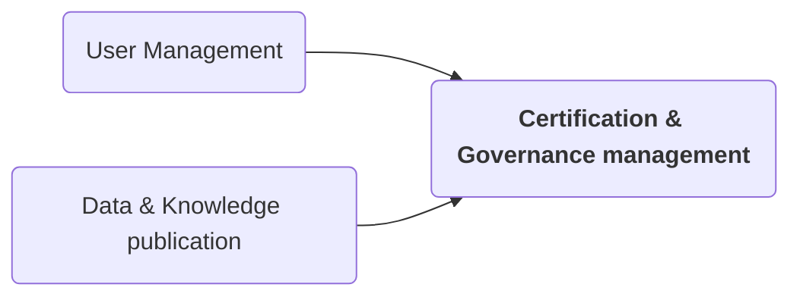

# Certification & Governance management (EV ILVO)

??? question to allign on: is this governance related to:

* connecting with a data space, 
* setting up the SWR as a data space 
* or common usage of data and knowledge by users? In case of the latter are we not further distributing "open data" 
and what extra governance policies do we need?

 

 

Soilwise plans to implement a governance framework to tackle the challenge of ensuring equitable access to and 
utilization of data and knowledge. This framework aims to foster data sharing and enable the generation of value 
from these resources. A governance framework encompasses a set of principles, standards, policies (rules/regulations), 
and practices. Additionally, the framework addresses the enforcement of these measures and the resolution of 
any conflicts that may arise.

The governance framework will be designed by integrating relevant EU legislation concerning governance within data 
ecosystems, alongside insights from ongoing Digital Europe CSA projects focused on constructing the Common European 
Data Spaces. The formulation of this governance framework will rely mainly on the Data Spaces Support Centre 
([DSSC](https://dssc.eu/){target=_blank}) 
results which are:

1. [Starter Kit](https://dssc.eu/space/SK/29523973/Starter+Kit+for+Data+Space+Designers+%7C+Version+1.0+%7C+March+2023){target=_blank}, 
a document that helps organizations and individuals understand the requirements for creating a data space by providing. 
a multifaceted view of data spaces, highlighting business, legal and governance, operational, functional, 
and technical aspects to consider
2. [Glossary](https://dssc.eu/space/Glossary/55443460/DSSC+Glossary+%7C+Version+1.0+%7C+March+2023){target=_blank} 
3. [Blueprint](https://confluence.external-share.com/content/80889/dssc_blueprintv05_public_consultation?sortChildren=tree){target=_blank}, 
a consistent and comprehensive set of guidelines to support the development cycle of data spaces.
 
Additionally, the DSSC proposes the utilization of the Building Blocks Taxonomy, which serves as a classification scheme. 
This taxonomy aids in describing, analyzing, and organizing data space initiatives based on predefined characteristics, 
thus promoting a structured approach to governance implementation (_Figure 1_). We will equally consider the [openDEI design principles for data spaces](https://design-principles-for-data-spaces.org/){target=_blank}, the requirements of [ISO 30401 for KM](https://iso-docs.com/blogs/iso-concepts/knowledge-management-system-iso-30401){target=_blank} and rely on the results of the preparatory 
action for the data space for Agriculture ([AgriDataSpace](https://agridataspace-csa.eu/){target=_blank}).

 

Following the introduction of the GDPR, the European Commission has put forward several legislative proposals, 
such as the Digital Services Act, the Digital Markets Act, the Data Act, and the Data Governance Act. 
Soilwise places particular emphasis on the [Data Governance Act](https://www.european-data-governance-act.com/){target=_blank} 
and the [Data Act](https://www.eu-data-act.com/){target=_blank}, as their primary goals 
align closely with the project's aims to enhance data sharing and facilitate product development. 
These legislations are designed to:

- Promote equity in the distribution of value derived from data across various stakeholders.
- Enhance access to data and its utilization.

The documents described in the higher paragraphs will be used to asses if the technical components used to develop and 
implement SWR meet the necessities for the governance of the data ecosystem. If this is not the case technical 
components adhering the governance requirements will be integrated in further iterations of the project.

- governance
- interoperability
- clearing house, broker, ...
- vocabulary provider (connects to knowledge graph)

- connections with: external repo, identity providers, connectors, UI/UX

## SoilWise Data Spaces (EV ILVO + WE)

_T1.4 will produce detailed technical specifications, including information on components to be (re)used, interfaces between them and explaining the data flows and processing schemes, **considering AgriDataSpace project** conceptual reference architecture, AI/ML architecture patterns and the Ethics by Design in AI._

### --- WE ---

A Data Space is a type of collaboration model defined as a decentralized infrastructure (where data is not stored centrally, but at the source) for trusted data sharing and exchange in data ecosystems, based on commonly agreed principles. There is no central repository into which data providers supply their data and from which consumers can access and retrieve data. Instead, data is exchanged directly between appropriate parties.

Data Space facilitates the secure exchange, linkage, and interoperability of data within a confined ecosystem, based on standards and collaborative governance models, while preserving the digital sovereignty of data owners. Data spaces enable the use of data that may not be open but provides a certain level of accessibility.

Image credited to IDSA: The Reference Architecture Model

### Components/ Design of a data space (based on the IDSA)

Thereare different approaches to designing data spaces, but the IDS-RAM (reference architecturemodel) of IDSA the International Data Space Association, which is characterizedby an open, reliable and federated architecture for cross-sectoral dataexchange, can be taken as a benchmark, containing at least a basic set ofcomponents necessary to build a robust data space.

The mostimportant components of Data Spaces are briefly described below.

### Connectors:
The Connector is the central technical component for secureand trusted data exchange, through which participants access data in a Data Space. It is handling the data according to policies defined by the data owner interms of access and usage rights, thus ensuring its sovereignty. IDSconnectors for instance can publish the description of their data endpoints atan IDS meta-data broker. This allows potential data consumers to look upavailable data sources and data in terms of content, structure quality, actuality and other attributes (source: IDSA).

Connectors can be certified in order to prevent malfunctionand to guarantee their integrity and compliance. 

### Intermediaries:
Intermediaries are services provided by third parties thatare necessary for publishing, searching and registering transactions. 

Some of the intermediaries are: 

- ### Vocabulary providers:
Vocabulary providers manage andoffer vocabularies and ontologies, reference data models and metadata toannotate and classify data sets, describe the datasets’relationships and define possibleconstraints. This allows data to be systematically organized, categorized andlabelled, thus improving interoperability.

- ### Metadata broker:
According to IDSA, the MetadataBroker forms the referenceimplementation for registration and search functionality compliantwith International Data Spaces. As such, it follows the generic connectorarchitecture described in the reference architecture model. (https://www.dataspaces.fraunhofer.de/en/software/broker.html#:~:text=The%20Metadata%20Broker%20constitutes%20the,in%20the%20reference%20architecture%20model)

- ### Identity providers:
An identity provider is a system entity that creates, maintains, manages and validates identityinformation for clients and also provides authentication services for trustedapplications within a federated or distributed network. (Source: wiki).

- ### Clearing house:
Clearing house allows to keepcontrol of the operationscarried out. The IDS clearing house for instance providesdecentralized and auditable traceability of all transactions if needed.

CONNECTOR:

- config and control of data access
- config and control of data usage
- user authorisation for data access

- connections with: Storage, APIs
- technologies used: Eclipse Dataspace Components Connector
- responsible person: Thorsten Reitz
- participating:

