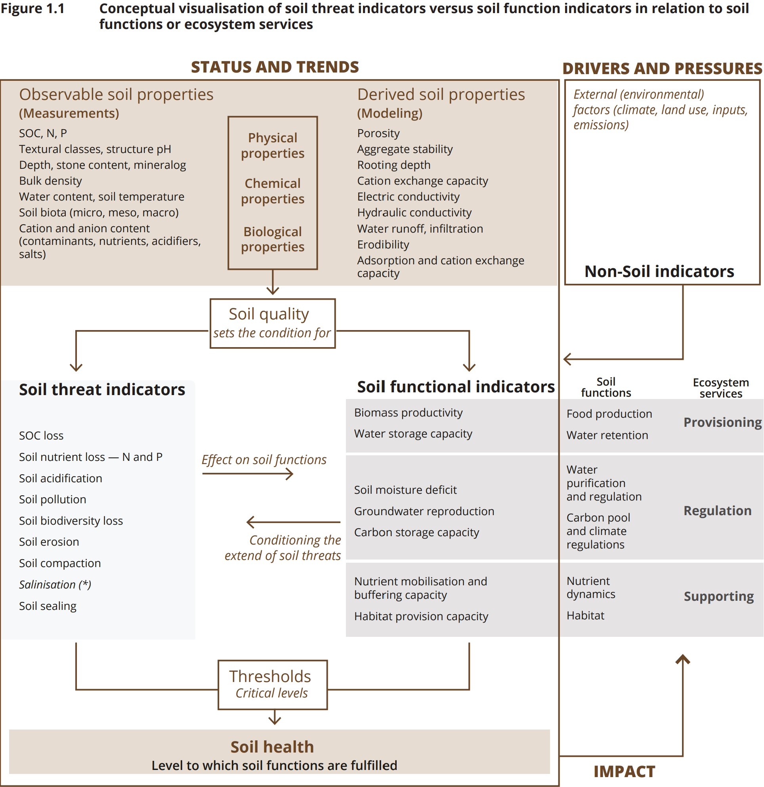

# Knowledge Graph

!!! component-header "Info"
    **Current version:** 0.2.6

    **Technology:** [RDF](https://www.w3.org/RDF/)

    **Release:** <https://doi.org/10.5281/zenodo.15596414>
   
    **Project repository:** [https://github.com/soilwise-he/soil-health-knowledge-graph](https://github.com/soilwise-he/soil-health-knowledge-graph)
   
    **Primary access point:** SWR SPARQL endpoint: [https://repository.soilwise-he.eu/sparql/](https://repository.soilwise-he.eu/sparql/)

## Introduction

SoilWise develops a **Soil Health Knowledge Graph (SHKG)** to capture and interlink soil-health concepts (e.g., soil functions, threats, indicators, thresholds) in a machine-readable and semantically consistent way. The SHKG is designed to in the future become part of the **semantic backbone** of the SoilWise data & knowledge hub: it provides shared terminology, concept relationships, and mappings to external vocabularies that can make SoilWise assets easier to discover, connect, and reuse.

The SHKG is implemented as an **RDF knowledge graph** and built to be ​**ontology-compliant**​, combining:

* a concept-centric representation (SKOS-driven),
* domain-specific relationships for soil science,
* and explicit links to established soil-related thesauri/ontologies to strengthen interoperability.

## What the SHKG Contains (Scope & Structure)

At a high level, the SHKG models:

* **Core soil health concepts** (soil, properties, functions, ecosystem services),
* **Soil threats/degradation processes** and their relationships,
* **Indicators** (general and specific) used for assessment,
* **Thresholds / critical ranges** (including contextualization such as soil type),
* **References and supporting entities** (e.g., bibliographic resources, policies, standards).

The current SHKG integrates **11,719 RDF triples** describing ​**2,017 entities**​, including ​**1,785 soil-related concepts**​.

## How We Construct the SHKG

SHKG construction follows a **semi-automated, human-in-the-loop pipeline** that combines LLM-based extraction with expert oversight to ensure ontological compliance and scientific quality.

### Knowledge sources

The initial SHKG is derived primarily from key soil-health literature, including:

* the EEA report **[*Soil monitoring in Europe – Indicators and thresholds for soil health assessments*](https://data.europa.eu/doi/10.2800/956606)** (selected as the primary source and provided the conceptual model shown in Figure 1.1),
* complemented where needed by additional sources to cover gaps.

This approach is intentionally extensible: no single report can cover the full scope of soil health, so the SHKG is designed to grow by iteratively incorporating additional sources and concepts.

### Ontology-compliant conceptual modeling

The SHKG uses a **concept-centric design** where most domain entities are represented as `skos:Concept`. This supports the primary use cases (annotation and discovery) by maximizing concept coverage and flexible linking.

To ensure semantic interoperability and consistent modeling:

* we reuse terms from established schemas/ontologies wherever possible,
* and define a controlled set of **soil-health-specific properties** when existing standards do not sufficiently express domain relationships (an explicit extension approach).

### LLM-assisted extraction + post-processing (human-in-the-loop)

The pipeline includes:

1. **LLM-based RDF triple generation** from selected text segments, producing Turtle-serialized RDF.
2. **Syntax validation/repair** (automated checking and correction for Turtle validity).
3. **Manual review & ontology alignment** to ensure entities/relations map to appropriate ontology terms and follow modeling conventions.
4. **Entity normalization** (preferred labels and alternative labels) and **relationship disambiguation** to reduce duplication and flag inconsistencies for expert review.

This workflow accelerates knowledge extraction while keeping the graph scientifically reliable through expert oversight.

### Knowledge graph enrichment (linking + reversible relations)

The SHKG is enriched by:

* **materializing invertible relationships** (adding inverse triples where appropriate),
* and **interlinking to external controlled vocabularies and thesauri** via SKOS mapping relations (`skos:exactMatch`, `skos:closeMatch`) to align SoilWise concepts with standardized terminologies.

## How We Validate the SHKG

Validation follows a structured methodology based on **competency questions (CQs)** and **SPARQL verification** with domain-expert review.

### Competency question formulation

* For each selected knowledge segment, we define a corresponding **competency question** that captures the intended knowledge to be represented.
* CQs are reviewed by soil scientists to ensure scientific validity and clarity.

### SPARQL execution and expert verification

* Each CQ is translated into a **SPARQL query** executed against the SHKG.
* Retrieved results are compared against the original source content to check coverage and correctness.
* Soil scientists review outputs to ensure the SHKG answers are technically correct and consistent with soil science principles.

This ensures the SHKG’s fidelity to its source material and its reliability for domain-specific querying.

## Linking to External Ontologies / Thesauri

A key goal of the SHKG is interoperability with broader semantic resources. The SHKG already includes mappings to established vocabularies and thesauri, enabling cross-resource navigation and reuse of standardized identifiers. A total of 493 concepts were found matching in the following ontologies and thesauri.

**Currently linked resources include:**

* [AGROVOC](http://aims.fao.org/aos/agrovoc)
* [ISO 11074:2025](https://data.geoscience.earth/ncl/ISO11074v2025)
* [GloSIS ontology](https://glosis-ld.github.io/glosis/)
* [INRAE Thesaurus](http://opendata.inrae.fr/thesaurusINRAE/)
* [GEMET Thesaurus](https://www.eionet.europa.eu/gemet/)

Linking is implemented using SKOS mapping properties (primarily `skos:exactMatch` and `skos:closeMatch`) based on label matching rules.

## SHKG as the Semantic Backbone of the SoilWise Data & Knowledge Hub

!!! component-header "Info"

    **Technology:** [VocView](https://github.com/ternaustralia/vocview)

    **Access point:** [https://voc.soilwise-he.containers.wur.nl/](https://voc.soilwise-he.containers.wur.nl/)
   

The SHKG is designed to act as the **semantic anchor** that connects SoilWise resources and external assets into one coherent discovery experience.

### Integration with SoilWise metadata

SoilWise also maintains an RDF representation of harvested metadata (a “metadata knowledge graph”). The SHKG connects to this metadata graph primarily via ​**[keyword matching](../metadata_augmentation/#keyword-matcher)**​, where SHKG concepts serve as controlled keywords that are matched to keywords in harvested metadata records, creating bidirectional links between the two graphs.

### What this enables

By using the SHKG as backbone, the SoilWise hub can:

* provide a **soil health thesaurus-like entry point** to concepts and their relationships,
* act as a **gateway to multiple external vocabularies** through SHKG mappings,
* and connect concepts directly to relevant SoilWise knowledge assets (papers, datasets, outputs) that mention or use these concepts.

### Feedback loop for enrichment

The integration also supports iterative improvement of the SHKG:

* unmatched metadata terms can be cataloged as candidate concepts,
* domain experts can review and prioritize them for future inclusion—helping identify coverage gaps and guide enrichment.

## Accessing the Soil Health Knowledge Graph

Depending on your needs (human exploration, application integration, bulk reuse), there are multiple ways to access the SHKG:

1. **SPARQL endpoint (query access)**
    * [https://repository.soilwise-he.eu/sparql/](https://repository.soilwise-he.eu/sparql/)
2. **GitHub repository (pipeline + sources + releases)**
    * [https://github.com/soilwise-he/soil-health-knowledge-graph](https://github.com/soilwise-he/soil-health-knowledge-graph)
3. **Ontology/portal publication (browsing & reuse)**
    * AgroPortal entry (SHKG) is available and provides a browsing-oriented interface [https://agroportal.lirmm.fr/ontologies/SHKG](https://agroportal.lirmm.fr/ontologies/SHKG).
4. **Resolved URI documentation (human-readable URI resolution)**
    * WIDOCO HTML site resolves SHKG URIs for documentation and exploration [https://soilwise-he.github.io/soil-health](https://soilwise-he.github.io/soil-health).
5. **Archived release / DOI (citation & reproducibility)**
    * Zenodo DOI provides a citable snapshot including KG, ontology schema, and validation assets [https://doi.org/10.5281/zenodo.14936019](https://doi.org/10.5281/zenodo.14936019).

## SoilVoc

!!! component-header "Info"
    **Current version:** 0.2.0

    **Technology:** [SKOS](https://www.w3.org/2004/02/skos/)
   
    **Project repository:** [https://github.com/soilwise-he/soil-vocabs](https://github.com/soilwise-he/soil-vocabs)
   
    **Access point:** [https://w3id.org/eusoilvoc](https://w3id.org/eusoilvoc)

SoilVoc (SoilWise Vocabulary Browser) is a **SKOS-based soil science thesaurus** designed to **connect soil knowledge with soil data**. Today, knowledge-centric resources (like SHKG) and data-centric resources (used for describing and annotating soil observations) often evolve in parallel and remain poorly connected, limiting discovery and interoperability.

SoilVoc bridges this gap by **linking soil properties with the procedures underlying those properties**, and by enforcing a **rigorous, transparent hierarchy** that enables controllable navigation from abstract concepts to concrete properties and their procedures. This will strengthen SoilWise’s semantic backbone and improves end-to-end discovery from concepts to data and outputs.
