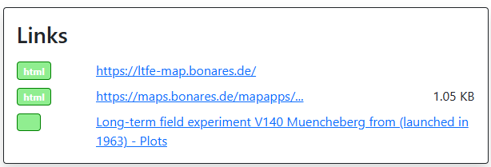
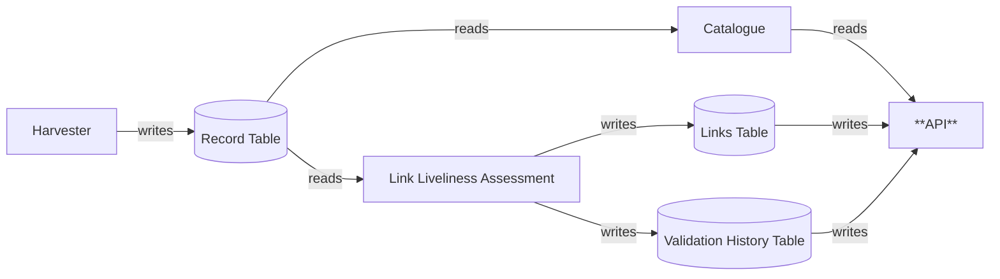
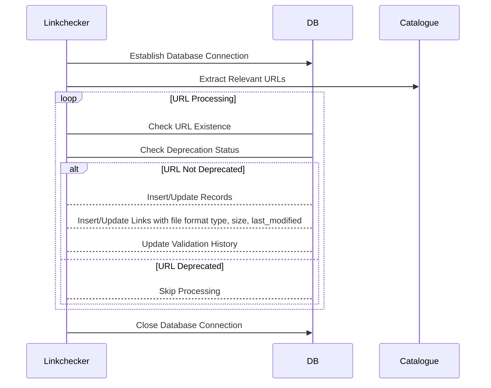
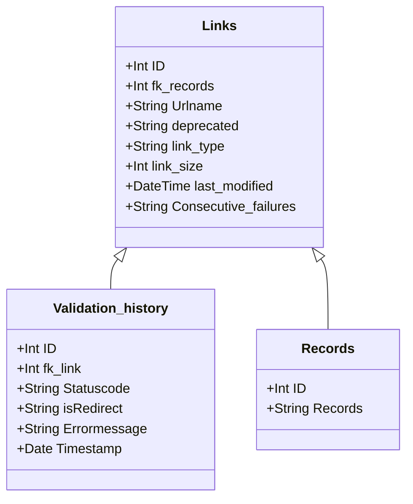
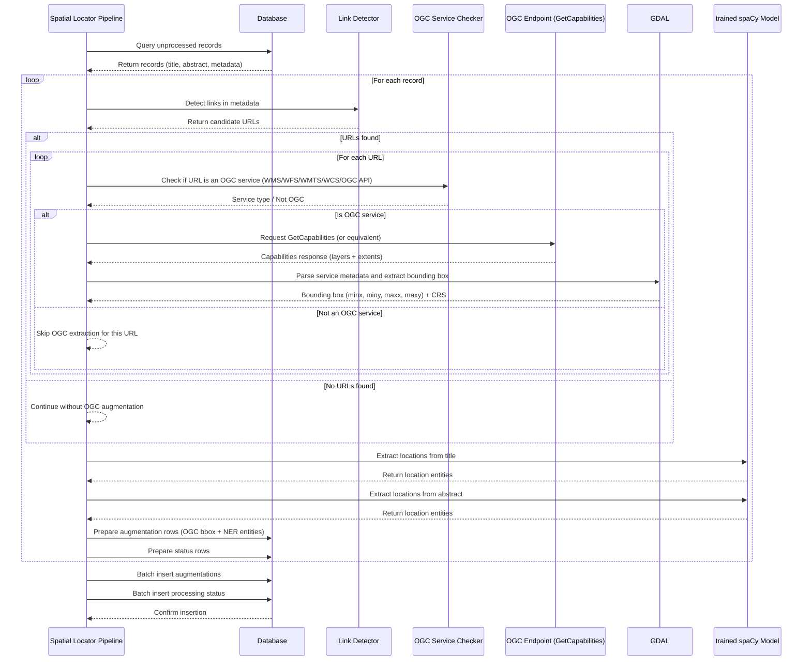

# Metadata Augmentation

## Introduction

### Overview and Scope
This set of components augments metadata statements using various techniques. 
Augmentations are stored on a dedicated augmentation table, indicating the process which produced it.
The statements are combined with the ingested content to offer users an optimal catalogue experience.

At the moment, Metadata Augmentation functionality is covered by the following components:

- [Keyword Matcher](#keyword-matcher)
- [Element Matcher](#element-matcher)
- [Translation Module](#translation-module)
- [Link Liveliness Assessment](#link-liveliness-assessment)
- [Spatial Locator](#spatial-locator)
- [Metadata Interlinker](#metadata-interlinker)

Upcoming components

- [Keyword extraction](#keyword-extraction)
- [Spatial scope analyser](#spatial-scope-analyser)
- [EUSO high-value dataset tagging](#euso-high-value-dataset-tagging)

### Intended Audience

Metadata Augmentation is a backend component providing outputs, which users can see displayed in the [Metadata Catalogue](catalogue.md). Therefore the Intended Audience corresponds to the one of the [Metadata Catalogue](../catalogue/#intended-audience). Additionally we expect a maintenance role:

* **SWC Administrator** monitoring the augmentation processes, access to history, logs and statistics. Administrators can manually start a specific augmentation process.

## Keyword matcher

!!! component-header "Info"
    **Current version:** 0.2.0

    **Technology:** Python 

    **Release:** <https://doi.org/10.5281/zenodo.14924181>

    **Projects:** [Keyword matcher](https://github.com/soilwise-he/metadata-augmentation/tree/main/keyword-matcher)

### Overview and Scope
Keywords are an important mechanism to filter and cluster records. Similar keywords need to be clustered to be able to match them. This module evaluates keywords of existing records to make them equal in case of high similarity. 

Analyses existing keywords on a metadata record. Two cases can be identified:

- If a keyword, having a skos identifier, has a closeMatch or sameAs relation to a prefered keyword, the prefered keyword is used. 
- If an existing keyword, without skos identifier, matches a prefered keyword by (translated) string or synonym, then append the matched keyword (including skos identifier). 

To facilitate this use case the SWR contains a [Knowledge graph](knowledge_graph.md) of prefered keywords in the soil domain derived from Agrovoc, Gemet and ISO11074. This knowledge graph is maintained at <https://github.com/soilwise-he/soil-health-knowledge-graph>. These vocabularies are multilingual, facilitating the translation case.

For metadata records which have not been analysed yet (in that iteration), the module extracts the keywords, for each keyword an analyses is made if it matches any of the prefered keywords, the prefered keyword is added to the augmentation results for that record. For string matching a fuzzy match algorithm is used, requiring a 90% match (configurable). Translations are matched using the metadata language as indicated in the record.

### Key Features

### Architecture
#### Technological Stack

|Technology|Description|
|----------|-----------|
|**Python**|Used for the keyword matching and database interactions.|
|**[PostgreSQL](https://www.postgresql.org/)**|Primary database for storing and managing information.|
|**Docker**|Used for containerizing the application, ensuring consistent deployment across environments.|
|* **CI/CD**|Automated pipeline for continuous integration and deployment, with scheduled dayly runs.|

#### Main Sequence Diagram
#### Database Design
### Integrations & Interfaces
### Key Architectural Decisions
* The process runs as a CI-CD pipeline at daily intervals.

### Risks & Limitations

## Element Matcher

### Overview and Scope
### Key Features
### Architecture
#### Technological Stack
#### Main Sequence Diagram
#### Database Design
### Integrations & Interfaces
### Key Architectural Decisions
### Risks & Limitations

## Translation module

!!! component-header "Info"
    **Current version:** 0.2.0

    **Technology:** Python

    **Projects:** [Translation](https://github.com/soilwise-he/metadata-augmentation/tree/main/translation)

### Overview and Scope
Some records arrive in a local language, SWR translates the main properties for the record: title and abstract into English, to offer a single language user experience. The translations are used in filtering and display of records.

The translation module builds on the EU translation service (API documentation at <https://language-tools.ec.europa.eu/>). Translations are stored in a database for reuse by the SWR.

The EU translation returns asynchronous responses to translation requests, this means that translations may not yet be available after initial load of new data. A callback operation populates the database, from that moment a translation is available to SWR. The translation service uses 2-letter language codes, it means a translation from a 3-letter iso code (as used in for example iso19139:2007) to 2-letter code is required. The EU translation service has a limited set of translations from a certain to alternative language available, else returns an error.

Initial translation is triggered by a running harvester. The translations will then be available once the record is ingested to the triplestore and catalogue database in a followup step of the harvester. 

### Key Features

### Architecture
#### Technological Stack
|Technology|Description|
|----------|-----------|
|**Python**|Used for the translation module, API development, and database interactions.|
|**[PostgreSQL](https://www.postgresql.org/)**|Primary database for storing and managing information.|
|**[FastAPI](https://fastapi.tiangolo.com/)**|Employed to create and expose REST API endpoints. Utilizes FastAPI's efficiency and auto-generated [Swagger](https://swagger.io/docs/specification/2-0/what-is-swagger/) documentation.|
|**Docker**|Used for containerizing the application, ensuring consistent deployment across environments.|
|**CI/CD**|Automated pipeline for continuous integration and deployment, with scheduled dayly runs.|

#### Main Sequence Diagram
#### Database Design
### Integrations & Interfaces
### Key Architectural Decisions
### Risks & Limitations

## Link Liveliness Assessment 

!!! component-header "Info"
    **Current version:** 1.1.4

    **Technology:** Python, [FastAPI](https://fastapi.tiangolo.com/)

    **Release:** <https://doi.org/10.5281/zenodo.14923790>

    **Projects:** [Link liveliness assessment](https://github.com/soilwise-he/link-liveliness-assessment)

### Overview and Scope
Metadata (and data and knowledge sources) tend to contain links to other resources. Not all of these URIs are persistent, so over time they can degrade. In practice, many non-persistent knowledge sources and assets exist that could be relevant for SWR, e.g. on project websites, in online databases, on the computers of researchers, etc. Links pointing to such assets might however be part of harvested metadata records or data and content that is stored in the SWC. 

The Link Liveliness Assessment (LLA) component runs over the available links stored with the SWC assets and checks their status. The function is foreseen to run frequently over the URIs in the SWC, assessing and storing the status of the link. 

A link in metadata record either points to:

-	another metadata record
-	a downloadable instance (pdf/zip/sqlite/mp4/pptx) of the resource
    - the resource itself
    - documentation about the resource
    - identifier of the resource (DOI)	   
-	a webservice or API (sparql, openapi, graphql, ogc-api)

Linkchecker evaluates for a set of metadata records, if:

-	the links to external sources are valid
-	the links within the repository are valid
-	link metadata represents accurately the resource (mime type, size, data model, access constraints)

While evaluating the context of a link, the LLA component may derive some contextual metadata, which can augment the metadata record. These results are stored in the metadata augmentation table. Metadata aspects derived are file size, file format.

### Key Features
The LLA component privides the following functions:

11.	**Link validation:** Returns HTTP status codes for each link, along with other important information such as the parent URL, any warnings, and the date and time of the test.
Additionally, the tool enhances link analysis by identifying various metadata attributes, including file format type (e.g., image/jpeg, application/pdf, text/html), file size (in bytes), and last modification date. This provides users with valuable insights about the resource before accessing it. 
2.	**Broken link categorization:** Identifies and categorizes broken links based on status codes, including Redirection Errors, Client Errors, and Server Errors. 
3.	**Deprecated links identification:** Flags links as deprecated if they have failed for X consecutive tests, in our case X equals to 10. Deprecated links are excluded from future tests to optimize performance. 
4.	**Timeout management:** Allows the identification of URLs that exceed a timeout threshold which can be set manually as a parameter in linkchecker's properties. 
5.	**Availability monitoring:** When run periodically, the tool builds a history of availability for each URL, enabling users to view the status of links over time. 
6.	OWS services (WMS, WFS, WCS, CSW) typically return a HTTP 500 error when called without the necessary parameters. A handling for these services has been applied in order to detect and include the necessary parameters before being checked.

A javascript widget is further used to display the link status directly in the SoilWise [Metadata Catalogue](catalogue.md) record.

The API can be used to identify which records have broken links.



### Architecture
#### Technological Stack

|Technology|Description|
|----------|-----------|
|**Python**|Used for the linkchecker integration, API development, and database interactions.|
|**[PostgreSQL](https://www.postgresql.org/)**|Primary database for storing and managing link information.|
|**[FastAPI](https://fastapi.tiangolo.com/)**|Employed to create and expose REST API endpoints. Utilizes FastAPI's efficiency and auto-generated [Swagger](https://swagger.io/docs/specification/2-0/what-is-swagger/) documentation.|
|**Docker**|Used for containerizing the application, ensuring consistent deployment across environments.|
|**CI/CD**|Automated pipeline for continuous integration and deployment, with scheduled weekly runs for link liveliness assessment.|

#### Main Component Diagram



#### Main Sequence Diagram



#### Database Design



### Integrations & Interfaces

-	Visualisation of evaluation in Metadata Catalogue, the assessment report is retrieved using ajax from the each record page
-   FastAPI now incorporates additional metadata for links, including file format type, size, and last modified date.

### Key Architectural Decisions

Initially we started with [linkchecker](https://pypi.org/project/LinkChecker/) library, but performance was really slow, because it tested the same links for each page again and again.
We decided to only test the links section of ogc-api:records, it means that links within for example metadata abstract are no longer tested.
OGC OWS services are a substantial portion of links, these services return error 500, if called without parameters. For this scenario we created a dedicated script.
If tests for a resource fail a number of times, the resource is no longer tested, and the resource tagged as `deprecated`.
Links via a facade, such as DOI, are followed to the page they are referring to. It means the LLA tool can understand the relation between DOI and the page it refers to.
For each link it is known on which record(s) it is mentioned, so if a broken link occurs, we can find a contact to notify in the record.

For the second release we have enhanced the link liveliness assement tool to collect more information about the resources:

  - **File type format** (media type) to help users understand what format they'll be accessing (e.g., image/jpeg, application/pdf, text/html)
  - **File size** to inform users about download expectations
  - **Last modification date** to indicate how recent the resource is

**API Updates:**
The API has been extended to include the newly tracked metadata fields:

- **link_type**: Shows the file format type of the resource (e.g., image/jpeg, application/pdf)
- **link_size**: Indicates the size of the resource in bytes
- **last_modified**: Provides the timestamp when the resource was modified

### Risks & Limitations

## Spatial Locator

!!! component-header "Info"
    **Current version:** 

    **Technology:** Python 

    **Release:** 

    **Projects:** [NER augmentation](https://github.com/soilwise-he/metadata-augmentation/tree/spatial-metadata-extractor/NER%20augmentation)


### Overview and Scope

The Spatial Locator component identifies and extracts location information from metadata records using multiple approaches:

1. **OGC Services Spatial Metadata:** Queries OGC services (WMS, WFS, WCS, CSW) if present in metadata links to extract spatial extent and coverage information, providing a robust method for spatial metadata augmentation.

2. **Named Entity Recognition (NER):** Extracts location entities from metadata titles and abstracts using a trained spaCy model. The component identifies location references in plain text present in the title and abstract, which are then stored as augmentations in the database. This enables spatial discovery and filtering of datasets within the SWC catalogue.
The component leverages a trained spaCy model specifically configured to recognize location entities labeled as `Location_positive`, ensuring high precision in spatial metadata extraction via the NER approach.

### Key Features
The Spatial Locator component privides the following functions:

1. **Detection of OGC service:** Automatically identifies if there are URL's present in the metadata that refers an OGC service and, if so, extracts the bounding box from the metadata of this service.
2. **Location Entity Extraction:** Automatically identifies location mentions in metadata titles and abstracts using a trained spaCy NER model.


### Architecture

#### Technological Stack

|Technology|Description|
|----------|-----------|
|**Python**|Core language for NER pipeline implementation and database interactions.|
|**[spaCy](https://spacy.io/)**|Industrial-strength NLP library used for the trained NER model and entity extraction.|
|**[PostgreSQL](https://www.postgresql.org/)**|Primary database for storing and managing information.|
| **[GDAL](https://gdal.org/)** | Geospatial data abstraction library used for OGC standards augmentation, enabling renabling extraction of bounding box of online geospatial data across formats and services (e.g. WMS, WFS, GML, GeoJSON). 

#### Main Sequence Diagram



#### Database Design

The Spatial Locator uses the following database structure:

- **metadata.records:** Source table containing identifier, title, and abstract fields
- **metadata.augments:** Stores extracted location entities with fields:
    - `record_id`: Link to the source record
    - `property`: Metadata field (e.g., 'title', 'abstract')
    - `value`: JSON-formatted location data containing text, start_char, and end_char
    - `process`: Set to 'NER-augmentation'
- **metadata.augment_status:** Tracks processing status with fields:
    - `record_id`: Link to the source record
    - `status`: Processing status (e.g., 'processed')
    - `process`: Set to 'NER-augmentation'

Example augmentation value:
```json
[
  {"text": "Rostock", "start_char": 45, "end_char": 52},
  {"text": "Germany", "start_char": 120, "end_char": 127}
]
```

### Integrations & Interfaces
### Key Architectural Decisions

- **Batch Processing:** Records are processed in batches to balance memory usage and database load. Unprocessed records are identified via a LEFT JOIN against the augment_status table.
- **Character-Level Offsets:** Location entities include start and end character positions to possible enable precise highlighting and linking in the catalogue interface.
- **JSON Storage:** Extracted locations are stored as JSON arrays to maintain structured data while allowing flexible querying and display options.
- **Configurable Model Path:** The model path can be specified via environment variable (`MODEL_PATH`) or command-line argument, allowing flexibility for different updates of the trained models.

### Risks & Limitations

- **Model Dependency:** Performance and accuracy depend entirely on the quality and training data of the spaCy NER model.
- **Entity Label Specificity:** the model is trained on a set of entity keywords and then finetuned based on location data already present in the catalogue.
- **Abstract And Title Processing:** Extraction may fail on malformed abstracts/titles, with errors logged and processing continuing to the next record.
- **Database Performance:** Large batch operations may impact database performance; batch size may need tuning based on system capacity.

## Metadata Interlinker

### Overview and Scope
To be able to provide interlinked data and knowledge assets (e.g. a dataset, the project in which it was generated and the operating procedure used) links between metadata must be identified and registered ideally as part of the [SWR Triple Store](./storage.md#virtuoso-triple-store-storage-of-swr-knowledge-graph).

We distinguish between explicit and implicit links:

- **Explicit links** can be directly derived from the data and/or metadata. E.g. projects in CORDIS are explicitly linked to documents and datasets. 
- **Implicit links** can not be directly derived from the (meta)data. They may be derived by spatial or temporal extent, keyword usage, or shared author/publisher. 

SWC implements the interlinking of data and knowledge assets based on explicit links that are found in the harvested metadata. The harvesting processes implemented in SWC have been extended with this function to detect such linkages and store them in the repository and add them to the SWC knowledge graph. This allows e.g. exposing this additional information to the UI for displaying and linkage the  and other functions. 

### Key Features
### Architecture
#### Technological Stack
#### Main Sequence Diagram
#### Database Design
### Integrations & Interfaces
### Key Architectural Decisions
### Risks & Limitations

## Foreseen functionality

In the next iterations, Metadata augmentation component is foreseen to include the following additional functions:

### Keyword extraction

The value of relevant keywords is often underestimated by data producers. This proof-of-concept module evaluates the metadata title/abstract to identify relevant keywords using NLP/NER technology. Integration with the [catalogue](./catalogue.md) is foreseen.

### Spatial scope analyser

A module that is foreseen to analyse the spatial scope of a resource.

The bounding box will be matched to country or continental bounding boxes using a gazeteer.

To understand if the dataset has a global, continental, national or regional scope

- Retrieves all datasets (as iso19139 xml) from database (records table joined with augmentations) which:
    - have a bounding box 
    - no spatial scope
    - in iso19139 format
- For each record it compares the boundingbox to country bounding boxes: 
    - if bigger then continents > global
    - If matches a continent > continental
    - if matches a country > national
    - if smaller > regional
- result is written to as an augmentation in a dedicated table

### EUSO-high-value dataset tagging

The EUSO high-value datasets are those with substantial potential to assess soil health status, as detailed on the [EUSO dashboard](https://esdac.jrc.ec.europa.eu/esdacviewer/euso-dashboard/). This framework includes the concept of [soil degradation indicator](https://esdac.jrc.ec.europa.eu/content/soil-degradation-indicators-eu) metadata-based identification and tagging. Each dataset (possibly only those with the supra-national spatial scope - under discussion) will be annotated with a potential soil degradation indicator for which it might be utilised. Users can then filter these datasets according to their specific needs. 

The EUSO soil degradation indicators employ specific [methodologies and thresholds](https://esdac.jrc.ec.europa.eu/euso/euso-dashboard-sources) to determine soil health status, see also the Table below. These methodologies will also be considered, as they may have an impact on the defined thresholds. This issue will be examined in greater detail in the future.

<table>
  <tr>
    <th>Soil Degradation</th>
    <th>Soil Indicator</th>
    <th>Type of methodic for threshold</th>
  </tr>
  <tr>
    <td rowspan="5" style="text-align: center; vertical-align: middle; font-weight: bold;">Soil erosion</td>
    <td>Water erosion</td>
    <td>RUSLE2015</td>
  </tr>
  <tr>
    <td>Wind erosion</td>
    <td>GIS-RWEQ</td>
  </tr>
  <tr>
    <td>Tillage erosion</td>
    <td>SEDEM</td>
  </tr>
  <tr>
    <td>Harvest erosion</td>
    <td>Textural index</td>
  </tr>
  <tr>
    <td>Post-fire recovery</td>
    <td>USLE (Type of RUSLE)</td>
  </tr>
  <tr>
    <td rowspan="5" style="text-align: center; vertical-align: middle; font-weight: bold;">Soil pollution</td>
    <td>Arsenic excess</td>
    <td>GAMLSS-RF</td>
  </tr>
  <tr>
    <td>Copper excess</td>
    <td>GLM and GPR</td>
  </tr>
  <tr>
    <td>Mercury excess</td>
    <td>LUCAS topsoil database</td>
  </tr>
  <tr>
    <td>Zinc Excess</td>
    <td>LUCAS topsoil database</td>
  </tr>
  <tr>
    <td>Cadmium Excess</td>
    <td>GEMAS</td>
  </tr>
  <tr>
    <td rowspan="3" style="text-align: center; vertical-align: middle; font-weight: bold;">Soil nutrients</td>
    <td>Nitrogen surplus</td>
    <td>NNB</td>
  </tr>
  <tr>
    <td>Phosphorus deficiency</td>
    <td>LUCAS topsoil database</td>
  </tr>
  <tr>
    <td>Phosphorus excess</td>
    <td>LUCAS topsoil database</td>
  </tr>
  <tr>
    <td style="text-align: center; vertical-align: middle; font-weight: bold;">Loss of soil organic carbon</td>
    <td>Distance to maximum SOC level</td>
    <td>qGAM</td>
  </tr>
  <tr>
    <td style="text-align: center; vertical-align: middle; font-weight: bold;">Loss of soil biodiversity</td>
    <td>Potential threat to biological functions</td>
    <td>Expert Polling, Questionnaire, Data Collection, Normalization and Analysis</td>
  </tr>
  <tr>
    <td style="text-align: center; vertical-align: middle; font-weight: bold;">Soil compaction</td>
    <td>Packing density</td>
    <td>Calculation of Packing Density (PD)</td>
  </tr>
  <tr>
    <td style="text-align: center; vertical-align: middle; font-weight: bold;">Salinization</td>
    <td>Secondary salinization</td>
    <td>-</td>
  </tr>
  <tr>
    <td style="text-align: center; vertical-align: middle; font-weight: bold;">Loss of organic soils</td>
    <td>Peatland degradation</td>
    <td>-</td>
  </tr>
  <tr>
    <td style="text-align: center; vertical-align: middle; font-weight: bold;">Soil consumption</td>
    <td>Soil sealing</td>
    <td>Raster remote sense data</td>
  </tr>
</table>

Technically, we forsee the metadata tagging process as illustrated below. At first, metadata record's title, abstract and keywords will be checked for the occurence of specific **values from the Soil Indicator and Soil Degradation Codelists**, such as `Water erosion` or `Soil erosion` (see the Table above). If found, the `Soil Degradation Indicator Tag` (corresponding value from the Soil Degradation Codelist) will be displayed to indicate suitability of given dataset for soil indicator related analyses. Additionally, a search for corresponding **methodology** will be conducted to see if the dataset is compliant with the EUSO Soil Health indicators presented in the [EUSO Dashboard](https://esdac.jrc.ec.europa.eu/esdacviewer/euso-dashboard/). If found, the tag `EUSO High-value dataset` will be added. In later phase we assume search for references to Scientific Methodology papers in metadata record's links. Next, the possibility of involving a more complex search using soil thesauri will also be explored.


