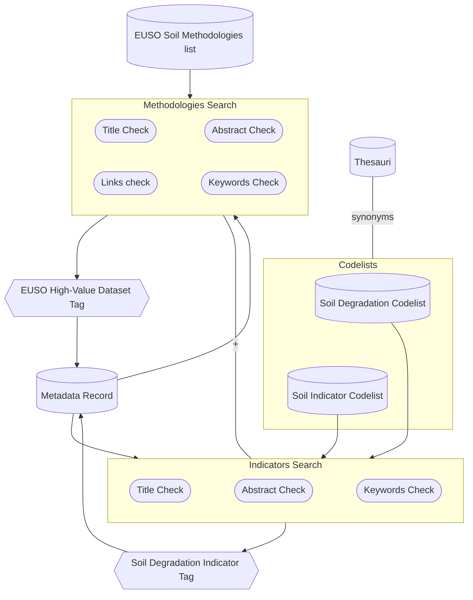

# Metadata Augmentation

This set of components augments metadata statements using various techniques. 
Augmentations are stored on a dedicated augmentation table, indicating the process which produced it.
The statements are combined with the ingested content to offer users an optimal catalogue experience.

At the moment, the functionality of the Metadata Augmentation component comprises these components:

- [Keyword-matcher](#keyword-matcher)
- [Translation module](#translation-module)
- [Link liveliness assessment](#link-liveliness-assessment)

Upcoming components

- [Spatial locator](#spatial-locator)
- [Spatial scope analyser](#spatial-scope-analyser)
- [Duplication identification](#duplication-identification)
- [Keyword extraction](#keyword-extraction)
- [Automatic metadata generation](#automatic-metadata-generation)

Metadata augmentation results are stored in a augmentation table (unless mentioned otherwise).

| metadata-uri | metadata-element | source | value | proces | date |
| --- | --- | --- | --- | --- | --- |
| <https://geo.fi/data/ee44-aa22-33> | spatial-scope | 16.7,62.2,18,81.5 |  <https://inspire.ec.europa.eu/metadata-codelist/SpatialScope/national> | spatial-scope-analyser | 2024-07-04 |
| <https://geo.fi/data/abc1-ba27-67> | soil-thread | This dataset is used to evaluate Soil Compaction in Nuohous Sundström | <http://aims.fao.org/aos/agrovoc/c_7163> | keyword-analyser | 2024-06-28 |

### Keyword matcher

!!! component-header "Info"
    **Current version:** 0.2.0

    **Projects:** [Keyword matcher](https://github.com/soilwise-he/metadata-augmentation/tree/main/keyword-matcher)

Keywords are an important mechanism to filter and cluster records. Similar keywords need to be clustered to be able to match them. This module evaluates keywords of existing records to make them equal in case of high similarity. 

Analyses existing keywords on a metadata record. Two cases can be identified:

- If a keyword, having a skos identifier, has a closeMatch or sameAs relation to a prefered keyword, the prefered keyword is used. 
- If an existing keyword, without skos identifier, matches a prefered keyword by (translated) string or synonym, then append the matched keyword (including skos identifier). 

To facilitate this use case the SWR contains a knowledge graph of prefered keywords in the soil domain derived from agrovoc, gemet and iso11074. This knowledge graph is maintained at <https://github.com/soilwise-he/soil-health-knowledge-graph>. These vocabularies are multilingual, facilitating the translation case.

For metadata records which have not been analysed yet (in that iteration), the module extracts the keywords, for each keyword an analyses is made if it maches any of the prefered keywords, if so, the prefered keyword is added to the augmentation results for that record. For string matching a fuzzy match algorythm is used, requiring a 90% match (configurable). Translations are matched using the metadata language as indicated in the record.

The process runs as a CI-CD pipeline at dayly intervals.

#### Technology
   * **Python**
        Used for the keyword matching and database interactions
   * **[PostgreSQL](https://www.postgresql.org/){target=_blank}**
        Primary database for storing and managing information
   * **Docker** 
        Used for containerizing the application, ensuring consistent deployment across environments
   * **CI/CD**
        Automated pipeline for continuous integration and deployment, with scheduled dayly runs

### Translation module

!!! component-header "Info"
    **Current version:** 0.2.0

    **Projects:** [Translation](https://github.com/soilwise-he/metadata-augmentation/tree/main/translation)

Some records arrive in a local language, SWR translates the main properties for the record: title and abstract into English, to offer a single language user experience. The translations are used in filtering and display of records.

The translation module builds on the EU translation service (API documentation at <https://language-tools.ec.europa.eu/>). Translations are stored in a database for reuse by the SWR.

The EU translation returns asynchronous responses to translation requests, this means that translations may not yet be available after initial load of new data. A callback operation populates the database, from that moment a translation is available to SWR. The translation service uses 2-letter language codes, it means a translation from a 3-letter iso code (as used in for example iso19139:2007) to 2-letter code is required. The EU translation service has a limited set of translations from a certain to alternative language available, else returns an error.

Initial translation is triggered by a running harvester. The translations will then be available once the record is ingested to the triplestore and catalogue database in a followup step of the harvester. 

#### Technology
   * **Python**
        Used for the translation module, API development, and database interactions
   * **[PostgreSQL](https://www.postgresql.org/){target=_blank}**
        Primary database for storing and managing information
   * **[FastAPI](https://fastapi.tiangolo.com/){target=_blank}**
        Employed to create and expose REST API endpoints. 
        Utilizes FastAPI's efficiency and auto-generated [Swagger](https://swagger.io/docs/specification/2-0/what-is-swagger/){target=_blank} documentation
   * **Docker** 
        Used for containerizing the application, ensuring consistent deployment across environments
   * **CI/CD**
        Automated pipeline for continuous integration and deployment, with scheduled dayly runs

### Link liveliness assessment 

!!! component-header "Info"
    **Current version:** 0.2.0

    **Projects:** [Link liveliness assessment](https://github.com/soilwise-he/link-liveliness-assessment)

Metadata (and data and knowledge sources) tend to contain links to other resources. Not all of these URIs are persistent, so over time they can degrade. In practice, many non-persistent knowledge sources and assets exist that could be relevant for SWR, e.g. on project websites, in online databases, on the computers of researchers, etc. Links pointing to such assets might however be part of harvested metadata records or data and content that is stored in the SWR. 

The link liveliness assessment subcomponent runs over the available links stored with the SWR assets and checks their status. The function is foreseen to run frequently over the URIs in the SWR repository, assessing and storing the status of the link. 

While evaluating the context of a link, the assessment tool may derive some contextual metadata, which can augment the metadata record. These results are stored in the metadata augmentation table. Metadata aspects derived are file size, file format.

The link liveliness  privides the following functions:

1. **OGC API Catalogue Integration**
    - Designed to work specifically with [OGC API - Records](https://ogcapi.ogc.org/records/){target=_blank}
    - Extracts and evaluates URLs from catalogue items 
2. **Link Validation**
    - Evaluates the validity of links to external sources and within the repository
    - Checks if metadata accurately represents the source
3. **Support for OGC service links**
    - Identifies and properly handles OGC service links ([WMS](https://www.ogc.org/standard/wms/){target=_blank}, [WFS](https://www.ogc.org/standard/wfs/){target=_blank}, [CSW](https://www.ogc.org/standard/cat/){target=_blank}, [WCS](https://www.ogc.org/standard/wcs/){target=_blank} etc.) before assessing them
4. **Health Status Tracking**
    - Provides up-to-date status history for every assessed link
    - Maintains a history of link health over time
4. **Flexible Evaluation**
    - Supports single resource evaluation on demand
    - Performs periodic tests to provide availability history
4. **Broken link management**
    - Identifies and categorizes broken links based on their status code ( `401 Unauthorized`, `404 Not Found`, `500 Server Error`)
    - Flags deprecated links after consecutive failed tests and excludes them from future check
5. **Timeout management**
    - Identifies resources exceeding specified timeout thresholds

A javascript widget is further used to display the link status directly in the [SWR Catalogue](catalogue.md) record.

The API can be used to identify which records have broken links.

#### Technology
   * **Python**
        Used for the linkchecker integration, API development, and database interactions
   * **[PostgreSQL](https://www.postgresql.org/){target=_blank}**
        Primary database for storing and managing link information
   * **[FastAPI](https://fastapi.tiangolo.com/){target=_blank}**
        Employed to create and expose REST API endpoints. 
        Utilizes FastAPI's efficiency and auto-generated [Swagger](https://swagger.io/docs/specification/2-0/what-is-swagger/){target=_blank} documentation
   * **Docker** 
        Used for containerizing the application, ensuring consistent deployment across environments
   * **CI/CD**
        Automated pipeline for continuous integration and deployment, with scheduled weekly runs for link liveliness assessment

## Foreseen functionality

In the next iterations, Metadata augmentation component is foreseen to include the following additional functions:

### Spatial Locator

!!! component-header "Info"
    **Current version:** 0.2.0
  
    **Project:** https://github.com/soilwise-he/metadata-augmentation/tree/main/spatial-locator

The module analyses existing keywords to find a relevant geography for the record, it then uses a gazeteer to find spatial coordinates for the geography, which are inserted into the metadata record. Vice versa, if the record has a geography it will use reverse gazeteer to find a matching location keyword.

### Spatial scope analyser

!!! component-header "Info"
    **Current version:** 0.2.0

    **Project:** https://github.com/soilwise-he/metadata-augmentation/tree/main/spatial-scope-analyser

A module that analyses the spatial scope of a resource.

The bounding box is matched to country or continental bounding boxes using a gazeteer.

To understand if the dataset has a global, continental, national or regional scope

- Retrieves all datasets (as iso19139 xml) from database (records table joined with augmentations) which:
    - have a bounding box 
    - no spatial scope
    - in iso19139 format
- For each record it compares the boundingbox to country bounding boxes: 
    - if bigger then continents > global
    - If matches a continent > continental
    - if matches a country > national
    - if smaller > regional
- result is written to as an augmentation in a dedicated table

### EUSO-high-value dataset tagging

The EUSO high-value datasets are those with substantial potential to assess soil health status, as detailed on the [EUSO dashboard](https://esdac.jrc.ec.europa.eu/esdacviewer/euso-dashboard/){target=_blank}. This framework includes the concept of [soil degradation indicator](https://esdac.jrc.ec.europa.eu/content/soil-degradation-indicators-eu){target=_blank} metadata-based identification and tagging. Each dataset (possibly only those with the supra-national spatial scope - under discussion) will be annotated with a potential soil degradation indicator for which it might be utilised. Users can then filter these datasets according to their specific needs. 

The EUSO soil degradation indicators employ specific [methodologies and thresholds](https://esdac.jrc.ec.europa.eu/euso/euso-dashboard-sources){target=_blank} to determine soil health status, see also the Table below. These methodologies will also be considered, as they may have an impact on the defined thresholds. This issue will be examined in greater detail in the future.

<table>
  <tr>
    <th>Soil Degradation</th>
    <th>Soil Indicator</th>
    <th>Type of methodic for threshold</th>
  </tr>
  <tr>
    <td rowspan="5" style="text-align: center; vertical-align: middle; font-weight: bold;">Soil erosion</td>
    <td>Water erosion</td>
    <td>RUSLE2015</td>
  </tr>
  <tr>
    <td>Wind erosion</td>
    <td>GIS-RWEQ</td>
  </tr>
  <tr>
    <td>Tillage erosion</td>
    <td>SEDEM</td>
  </tr>
  <tr>
    <td>Harvest erosion</td>
    <td>Textural index</td>
  </tr>
  <tr>
    <td>Post-fire recovery</td>
    <td>USLE (Type of RUSLE)</td>
  </tr>
  <tr>
    <td rowspan="5" style="text-align: center; vertical-align: middle; font-weight: bold;">Soil pollution</td>
    <td>Arsenic excess</td>
    <td>GAMLSS-RF</td>
  </tr>
  <tr>
    <td>Copper excess</td>
    <td>GLM and GPR</td>
  </tr>
  <tr>
    <td>Mercury excess</td>
    <td>LUCAS topsoil database</td>
  </tr>
  <tr>
    <td>Zinc Excess</td>
    <td>LUCAS topsoil database</td>
  </tr>
  <tr>
    <td>Cadmium Excess</td>
    <td>GEMAS</td>
  </tr>
  <tr>
    <td rowspan="3" style="text-align: center; vertical-align: middle; font-weight: bold;">Soil nutrients</td>
    <td>Nitrogen surplus</td>
    <td>NNB</td>
  </tr>
  <tr>
    <td>Phosphorus deficiency</td>
    <td>LUCAS topsoil database</td>
  </tr>
  <tr>
    <td>Phosphorus excess</td>
    <td>LUCAS topsoil database</td>
  </tr>
  <tr>
    <td style="text-align: center; vertical-align: middle; font-weight: bold;">Loss of soil organic carbon</td>
    <td>Distance to maximum SOC level</td>
    <td>qGAM</td>
  </tr>
  <tr>
    <td style="text-align: center; vertical-align: middle; font-weight: bold;">Loss of soil biodiversity</td>
    <td>Potential threat to biological functions</td>
    <td>Expert Polling, Questionnaire, Data Collection, Normalization and Analysis</td>
  </tr>
  <tr>
    <td style="text-align: center; vertical-align: middle; font-weight: bold;">Soil compaction</td>
    <td>Packing density</td>
    <td>Calculation of Packing Density (PD)</td>
  </tr>
  <tr>
    <td style="text-align: center; vertical-align: middle; font-weight: bold;">Salinization</td>
    <td>Secondary salinization</td>
    <td>-</td>
  </tr>
  <tr>
    <td style="text-align: center; vertical-align: middle; font-weight: bold;">Loss of organic soils</td>
    <td>Peatland degradation</td>
    <td>-</td>
  </tr>
  <tr>
    <td style="text-align: center; vertical-align: middle; font-weight: bold;">Soil consumption</td>
    <td>Soil sealing</td>
    <td>Raster remote sense data</td>
  </tr>
</table>

Technically, we forsee the metadata tagging process as illustrated below. At first, metadata record's title, abstract and keywords will be checked for the occurence of specific **values from the Soil Indicator and Soil Degradation Codelists**, such as `Water erosion` or `Soil erosion` (see the Table above). If found, the `Soil Degradation Indicator Tag` (corresponding value from the Soil Degradation Codelist) will be displayed to indicate suitability of given dataset for soil indicator related analyses. Additionally, a search for corresponding **methodology** will be conducted to see if the dataset is compliant with the EUSO Soil Health indicators presented in the [EUSO Dashboard](https://esdac.jrc.ec.europa.eu/esdacviewer/euso-dashboard/){target=_blank}. If found, the tag `EUSO High-value dataset` will be added. In later phase we assume search for references to Scientific Methodology papers in metadata record's links. Next, the possibility of involving a more complex search using soil thesauri will also be explored.

### Duplication identification

!!! component-header "Info"
    **Current version:** 0.2.0

    **Project:** https://github.com/soilwise-he/metadata-augmentation/tree/main/deduplication

Resources are often described in multiple data & knowledge hubs, not always using a unique identification. In that scenario
multiple records may arrive in the system which describe the same resource. In the harvester module duplication is prevented based on common identification. Additional duplication identification is relevant in cases where resources use different identification.

This process uses NLP mechanisms to evaluate metadata records on similarities. 

### Keyword extraction

!!! component-header "Info"
    **Current version:** 0.2.0

    **Project:** https://github.com/soilwise-he/metadata-augmentation/tree/main/NER%20augmentation

The value of relevant keywords is often underestimated by data producers. This module evaluates the metadata title/abstract to identify relevant keywords using NLP/NER technology.

### Automatic metadata generation

In cases where metadata describes a document or supplemental documentation about a resource is provided, the system is able to download that textual content and keep it as part of the search index. See [Harvest component](./ingestion.md) about how the content is harvested.
With that content available a LLM powered module is able to generate some aspects of a metadata record based on that content, in cases where the metadata record is poorly populated. Aspects to be populated by the module are: Title, abstract, keywords, organization, spatial and temporal extent, date.
