# Metadata Augmentation

## Introduction

### Overview and Scope
This set of components augments metadata statements using various techniques. 
Augmentations are stored on a dedicated augmentation table, indicating the process which produced it.
The statements are combined with the ingested content to offer users an optimal catalogue experience.

At the moment, Metadata Augmentation functionality is covered by the following components:

- [Keyword Matcher](#keyword-matcher)
- [Element Matcher](#element-matcher)
- [Link Liveliness Assessment](#link-liveliness-assessment)
- [Spatial Metadata Extractor](#spatial-metadata-extractor)

Upcoming components

- [Keyword extraction](#keyword-extraction)
- [Spatial scope analyser](#spatial-scope-analyser)
- [EUSO high-value dataset tagging](#euso-high-value-dataset-tagging)
- [Translation Module](#translation-module)

### Intended Audience

Metadata Augmentation is a backend component providing outputs, which users can see displayed in the [SoilWise Finder](catalogue.md). Therefore the Intended Audience corresponds to the one of the [SoilWise Finder](../catalogue/#intended-audience). Additionally we expect a maintenance role:

* **SWC Administrator** monitoring the augmentation processes, access to history, logs and statistics. Administrators can manually start a specific augmentation process.

## Keyword Matcher

!!! component-header "Info"
    **Current version:** 0.3.0

    **Technology:** Python

    **Release:** <https://zenodo.org/records/14924182>

    **Projects:** [Metadata Augmentation](https://github.com/soilwise-he/metadata-augmentation)

### Overview and Scope

Harvested metadata records carry keyword subjects drawn from a wide range of vocabularies, thesauri, and free-text conventions. The same concept may appear as a URI from one thesaurus, a free-text label in another, or a localized term in a third. This heterogeneity makes it difficult to search or filter the SoilWise Catalogue by topic.

The Keyword Matcher component normalizes keyword subjects against the SoilVoc, enriched with links to external vocabularies (AgroVoc, ISO 11074) and their multilingual labels. Each harvested subject is matched to a SoilVoc concept — by URI when possible, or by fuzzy label match when not — and the result is written to the database from which the Catalogue reads normalized concept values for filtering and faceting.

The component is organized as a two-stage pipeline:

- **Thesaurus build (`get_thesaurus.py`)** — compiles a single `concepts.json` artefact that merges SoilVoc concepts with URIs and multilingual labels gathered from AgroVoc and ISO 11074. Run manually, only when SoilVoc changes.
- **Daily matching (`match.py`)** — reads unprocessed subjects from the database, matches each against `concepts.json`, and writes the result to `metadata.keyword_match`. Run on a daily GitLab CI/CD pipeline.

### Key Features

The Keyword Matcher provides the following functions:

1. **Multi-vocabulary thesaurus enrichment:** SoilVoc concepts are extended with `skos:exactMatch` and `skos:closeMatch` links to AgroVoc (via remote SPARQL) and ISO 11074 (via local TTL), producing a unified set of URIs per concept.
2. **Multilingual concept labels:** Each concept collects labels in English, French, German, Italian, Spanish, and Dutch from all linked vocabularies, enabling matching against non-English keyword subjects.
3. **URI-based exact match (priority):** If a subject carries a URI, the matcher looks it up against the combined URI set of each concept — a deterministic match that bypasses the fuzzy path.
4. **Label-based fuzzy match (fallback):** If a subject has no URI, its label is compared case-insensitively against every concept label in every language with a threshold of 80. The best-scoring concept above the threshold wins.
5. **Fuzzy score persisted:** Each fuzzy match stores its score in the database, so reviewers can filter or audit low-confidence matches.
6. **Prefix-number cleanup:** Labels prefixed with numbers (e.g. from hierarchical thesaurus codes) are stripped before matching.
7. **Incremental processing:** Only subjects not yet processed are queried and matched on each daily run.
8. **Planned — LLM/NLP review of borderline matches:** A future layer will re-evaluate fuzzy matches with scores between 80 and 100 using an LLM or NLP model, to separate true matches from near-misses that happen to score high on string similarity alone.

### Architecture

#### Technological Stack

|Technology|Description|
|----------|-----------|
|**Python**|Core implementation language for both the thesaurus build and the matcher.|
|**[rdflib](https://rdflib.readthedocs.io/)**|Parses local SKOS TTL files (SoilVoc, ISO 11074) and executes SPARQL queries over them.|
|**[thefuzz](https://github.com/seatgeek/thefuzz)**|Provides `fuzz.ratio` used for label-based fuzzy matching.|
|**[PostgreSQL](https://www.postgresql.org/)**|Source of harvested subjects (`metadata.subjects`) and sink for matched concepts (`metadata.keyword_match`).|
|**GitLab CI/CD**|Runs `match.py` daily against the production database.|

#### Main Component Diagram

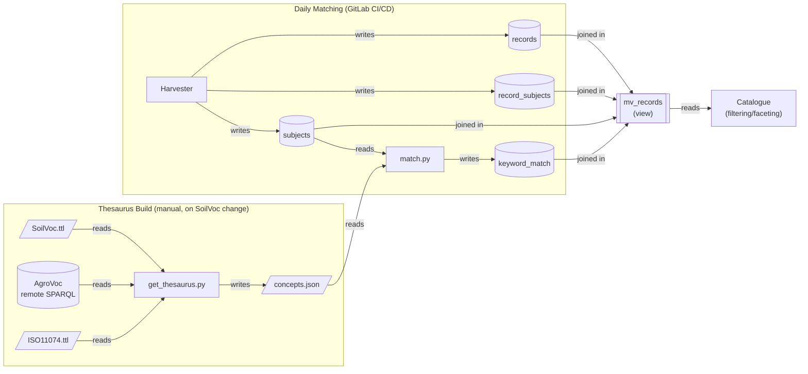
```mermaid
flowchart LR
    subgraph Build["Thesaurus Build (manual, on SoilVoc change)"]
        SV[/"SoilVoc.ttl"/]-- "reads" -->GT["get_thesaurus.py"]
        AG[("AgroVoc<br/>remote SPARQL")]-- "reads" -->GT
        ISO[/"ISO11074.ttl"/]-- "reads" -->GT
        GT-- "writes" -->CJ[/"concepts.json"/]
    end

    subgraph Daily["Daily Matching (GitLab CI/CD)"]
        H["Harvester"]-- "writes" -->SUB[("subjects")]
        H-- "writes" -->RS[("record_subjects")]
        H-- "writes" -->REC[("records")]
        SUB-- "reads" -->MM["match.py"]
        CJ-- "reads" -->MM
        MM-- "writes" -->KM[("keyword_match")]
    end

    REC-- "joined in" -->MV[["mv_records<br/>(view)"]]
    RS-- "joined in" -->MV
    SUB-- "joined in" -->MV
    KM-- "joined in" -->MV
    MV-- "reads" -->CA["Catalogue<br/>(filtering/faceting)"]
```

#### Main Sequence Diagram

**Thesaurus build (manual):**

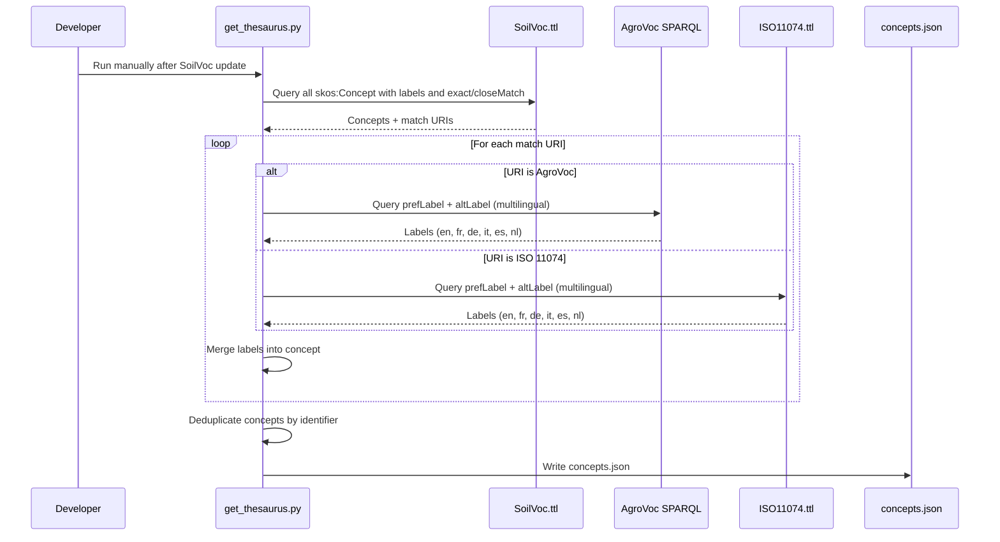
```mermaid
sequenceDiagram
    participant Dev as Developer
    participant GT as get_thesaurus.py
    participant SV as SoilVoc.ttl
    participant AG as AgroVoc SPARQL
    participant ISO as ISO11074.ttl
    participant CJ as concepts.json

    Dev->>GT: Run manually after SoilVoc update
    GT->>SV: Query all skos:Concept with labels and exact/closeMatch
    SV-->>GT: Concepts + match URIs

    loop For each match URI
        alt URI is AgroVoc
            GT->>AG: Query prefLabel + altLabel (multilingual)
            AG-->>GT: Labels (en, fr, de, it, es, nl)
        else URI is ISO 11074
            GT->>ISO: Query prefLabel + altLabel (multilingual)
            ISO-->>GT: Labels (en, fr, de, it, es, nl)
        end
        GT->>GT: Merge labels into concept
    end

    GT->>GT: Deduplicate concepts by identifier
    GT->>CJ: Write concepts.json
```

**Daily matching:**

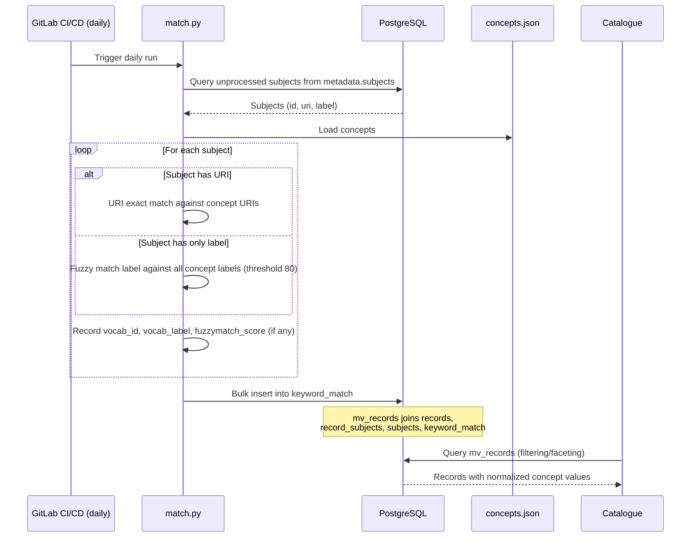
```mermaid
sequenceDiagram
    participant CI as GitLab CI/CD (daily)
    participant MM as match.py
    participant DB as PostgreSQL
    participant CJ as concepts.json
    participant CA as Catalogue

    CI->>MM: Trigger daily run
    MM->>DB: Query unprocessed subjects from metadata.subjects
    DB-->>MM: Subjects (id, uri, label)
    MM->>CJ: Load concepts

    loop For each subject
        alt Subject has URI
            MM->>MM: URI exact match against concept URIs
        else Subject has only label
            MM->>MM: Fuzzy match label against all concept labels (threshold 80)
        end
        MM->>MM: Record vocab_id, vocab_label, fuzzymatch_score (if any)
    end

    MM->>DB: Bulk insert into keyword_match

    Note over DB: mv_records joins records,<br/>record_subjects, subjects, keyword_match
    CA->>DB: Query mv_records (filtering/faceting)
    DB-->>CA: Records with normalized concept values
```

#### Database Design

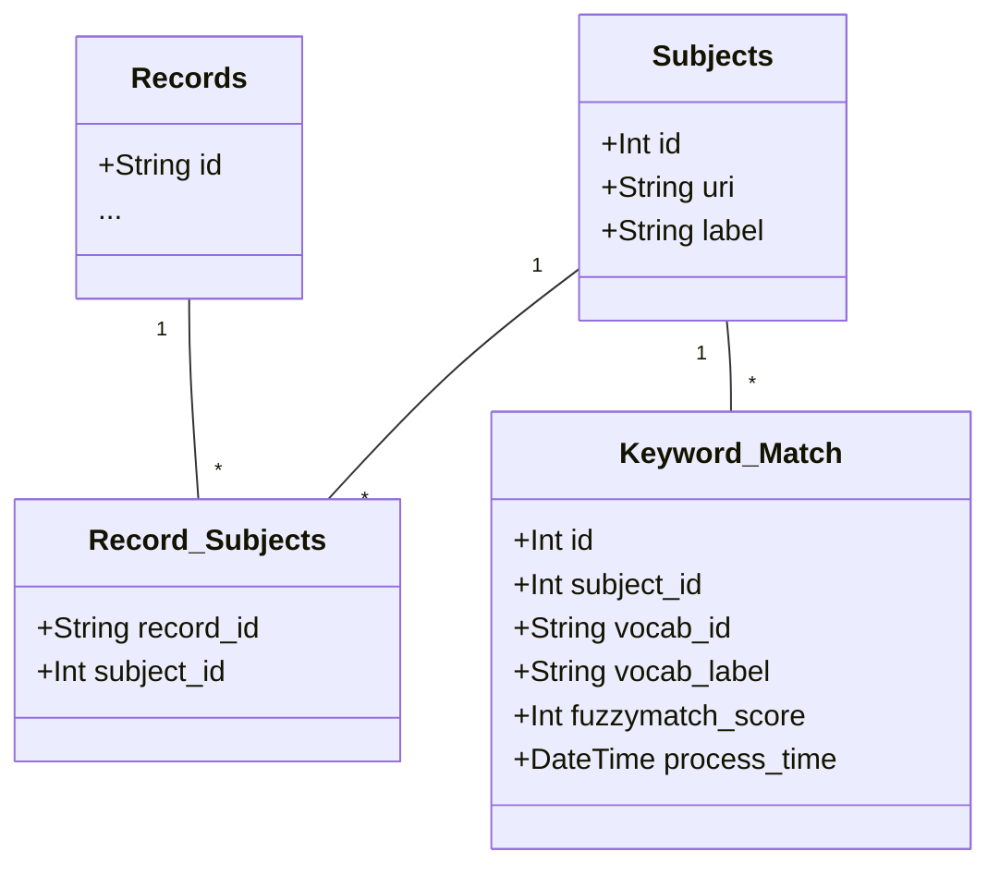
```mermaid
classDiagram
    Records "1" -- "*" Record_Subjects
    Subjects "1" -- "*" Record_Subjects
    Subjects "1" -- "*" Keyword_Match

    class Records {
        +String id
        ...
    }
    class Subjects {
        +Int id
        +String uri
        +String label
    }
    class Record_Subjects {
        +String record_id
        +Int subject_id
    }
    class Keyword_Match {
        +Int id
        +Int subject_id
        +String vocab_id
        +String vocab_label
        +Int fuzzymatch_score
        +DateTime process_time
    }
```

- `records` harvested records.
- `subjects`  distinct keyword subjects, each with optional `uri` and `label`.
- `record_subjects`  many-to-many link between records and subjects.
- `keyword_match`  output of the Keyword Matcher; one row per processed subject, linked back to `subjects` via `subject_id`. `fuzzymatch_score` is `NULL` for URI matches and set to the `fuzz.ratio` score for label matches.

### Integrations & Interfaces

- **Harvester → Keyword Matcher** consumes original keywords populated by the harvester.
- **Vocabularies → Keyword Matcher** reads SoilVoc, AgroVoc, and ISO 11074.
- **Keyword Matcher → Catalogue:** the Catalogue frontend reads normalized concept values from the database.

### Key Architectural Decisions

1. **Two-stage pipeline (thesaurus build vs. daily matching):** decouples the expensive, network-dependent thesaurus enrichment from the daily matching job, so daily runs are fast and independent of AgroVoc endpoint availability.
2. **SoilVoc as the anchor vocabulary:** all concepts are identified by a SoilVoc URI. AgroVoc and ISO 11074 contribute additional URIs and multilingual labels via SKOS `exactMatch` / `closeMatch`, but do not introduce new concepts.
3. **Fuzzy threshold 80:** balances precision and recall for domain terms. Scores below 80 are discarded; scores above 80 are persisted and (planned) reviewed by an LLM/NLP layer.
4. **Fuzzy score persisted:** stored alongside each match so low-confidence matches can be audited, filtered, or re-reviewed without rerunning the matcher.
5. **`concepts.json` as a versioned build artefact:** the thesaurus is a file in the repo, not a live query. It is rebuilt only when SoilVoc changes, so the daily matcher sees a stable, inspectable snapshot.
6. **Incremental processing:** only subjects not yet processed are matched on each run, keeping daily jobs cheap.

### Risks & Limitations

- **Fuzzy match result need review:** string similarity alone can produce false positives for short or generic terms.
- **Short keywords score poorly:** fuzzy match can report low scores for short but semantically identical terms, so some true matches fall below the threshold.
- **Multilingual coverage:** non-English matching only works for languages that have labels in the source vocabularies. Only 5 languages are supported. Concepts without AgroVoc/ISO 11074 links are English-only.
- **Concept hierachy not invloved:** the hierachy of concepts exsist in the SoilVoc but is not introduced this component. To enable a grouped facet search in the front-end a source of structure is needed.


## Element Matcher

!!! component-header "Info"
    **Current version:** 0.3.0

    **Technology:** Python

    **Release:** <https://zenodo.org/records/14924182>

    **Projects:** [Metadata Augmentation](https://github.com/soilwise-he/metadata-augmentation)

### Overview and Scope

Harvested metadata records arrive with element values drawn from many different vocabularies, schemas, and free-text conventions. For example, the `type` element may appear as `Article`, `Journal Article`, `text/journal`, or `publication`, and the `language` element may be encoded as `eng`, `en`, `english`, or `en-GB`. This heterogeneity makes it difficult to filter records in the SoilWise Catalogue by elements.

The Element Matcher component normalizes selected metadata elements against controlled mapping files, producing a consistent set of values. It reads records from the `metadata.records` table, maps each element value against a curated CSV mapping, and writes the normalized value to the `metadata.augments` table alongside the element name and a processing timestamp.

The component currently normalizes the following elements:

- **`type`** — record resource type (e.g. `Journal Article`, `Dataset`, `Software`)
- **`language`** — ISO 639-1 language code (e.g. `en`, `nl`, `fr`)

Planned:

- **`license`** — normalized license identifier (e.g. `cc-by`, `cc-by-sa`, `cc-0`).

### Key Features

The Element Matcher provides the following functions:

1. **CSV-driven value mapping:** Each element has its own mapping file under `element-matcher/mapping/` (`type.csv`, `lang.csv`, `license.csv`), defining a `source_label` → `target_label` relation. Mappings are case-insensitive on the source side.
2. **Incremental processing:** Only records that have not yet been processed by the Element Matcher are queried and matched, keeping daily runs cheap as the catalogue grows.
3. **Per-element matchers:** Matching is implemented as a separate function per element (`match_types`, `match_langs`, …), so new elements can be added without affecting existing ones.
4. **Unmapped-value logging:** When a source value is not present in the mapping file, the record identifier and the unmatched value are logged, and a summary of all unmapped values is emitted at the end of each run. These logs drive curation of the mapping files.
5. **Open mapping files:** Mapping CSVs live in the repository and are open for review and contribution by users, so the normalization rules are transparent and versioned alongside the code.
6. **Bulk insert:** Matched values are written to `metadata.augments` in a single bulk insert per element, rather than row-by-row.


### Architecture

#### Technological Stack

|Technology|Description|
|----------|-----------|
|**Python**|Core implementation language for the matcher and database interactions.|
|**[PostgreSQL](https://www.postgresql.org/)**|Source of metadata records (`metadata.records`) and sink for augmented values (`metadata.augments`).|
|**CSV**|Human-readable, git-versioned mapping files (`source_label` → `target_label`) per element.|
|**GitLab CI/CD**|Automated pipeline that runs the Element Matcher daily against the production database.|

#### Main Component Diagram

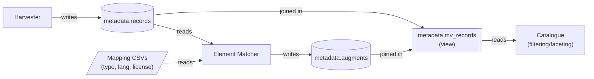
```mermaid
flowchart LR
    H["Harvester"]-- "writes" -->MR[("metadata.records")]
    MR-- "reads" -->EM["Element Matcher"]
    MAP[/"Mapping CSVs<br/>(type, lang, license)"/]-- "reads" -->EM
    EM-- "writes" -->AUG[("metadata.augments")]
    MR-- "joined in" -->MV[["metadata.mv_records<br/>(view)"]]
    AUG-- "joined in" -->MV
    MV-- "reads" -->CA["Catalogue<br/>(filtering/faceting)"]
```

#### Main Sequence Diagram

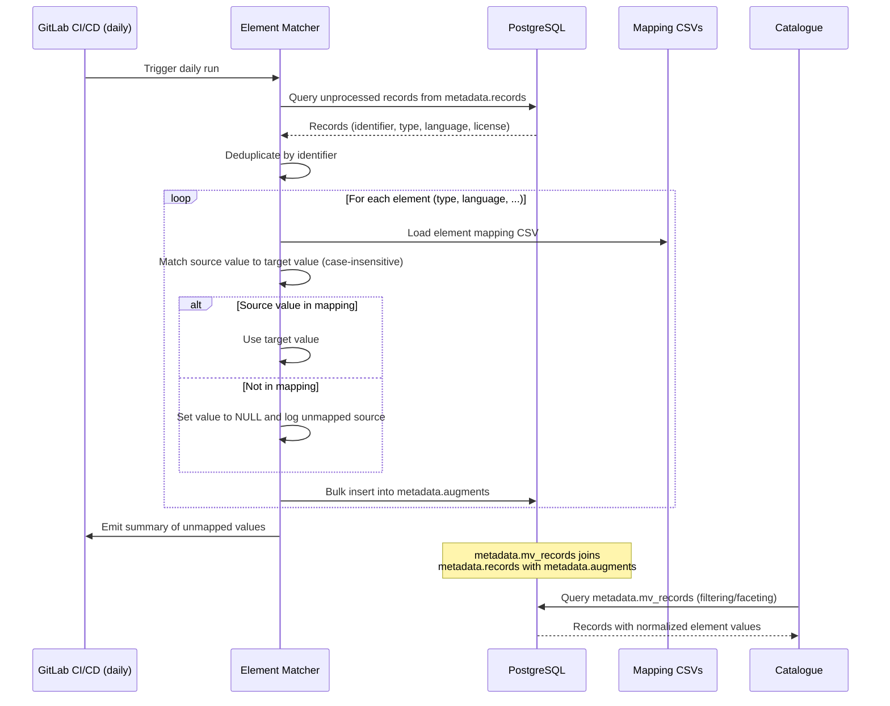
```mermaid
sequenceDiagram
    participant CI as GitLab CI/CD (daily)
    participant EM as Element Matcher
    participant DB as PostgreSQL
    participant MAP as Mapping CSVs
    participant CA as Catalogue

    CI->>EM: Trigger daily run
    EM->>DB: Query unprocessed records from metadata.records
    DB-->>EM: Records (identifier, type, language, license)
    EM->>EM: Deduplicate by identifier

    loop For each element (type, language, ...)
        EM->>MAP: Load element mapping CSV
        EM->>EM: Match source value to target value (case-insensitive)
        alt Source value in mapping
            EM->>EM: Use target value
        else Not in mapping
            EM->>EM: Set value to NULL and log unmapped source
        end
        EM->>DB: Bulk insert into metadata.augments
    end

    EM->>CI: Emit summary of unmapped values

    Note over DB: metadata.mv_records joins<br/>metadata.records with metadata.augments
    CA->>DB: Query metadata.mv_records (filtering/faceting)
    DB-->>CA: Records with normalized element values
```

#### Database Design

The Element Matcher reuses `metadata.augments` table described in [Spatial Metadata Extractor - Database Design](#sme-database-design).

### Integrations & Interfaces

- **Harvester → Element Matcher:** consumes `metadata.records` rows produced by the harvester component.
- **Element Matcher → Catalogue:** writes normalized values to `metadata.augments`. The Catalogue uses element values from a view, which joined with `metadata.augments` for the filtering.
- **Mapping files:** CSV mapping files are the public integration point for curators; edits are reviewed via pull request and take effect on the next daily run.


### Key Architectural Decisions

1. **CSV-based mapping files over SKOS/ontology lookups**: simple, human-editable, versionable in git, and diffable in code review. Mapping files are open for user review for transparency. Avoid False Positives for mapping.
2. **Unmapped values stored as `NULL`**: forces curation of the mapping file rather than introducing noisy or inconsistent values into the catalogue.
3. **Incremental processing**: daily runs stay cheap as the catalogue grows.
4. **Per-element matcher functions**: new elements (e.g. license) can be added independently without touching existing logic.


### Risks & Limitations

- **Exact match only:** the matcher does not handle typos, near-matches, or compound values. Each variant must be listed explicitly in the mapping file.
- **License matching:** license values are difficult to be harmonalized.
- **Manual mapping maintenance:** as new data sources are harvested, new unmapped values will appear and require human review before the catalogue reflects them.

## Link Liveliness Assessment 

!!! component-header "Info"
    **Current version:** 1.1.4

    **Technology:** Python, [FastAPI](https://fastapi.tiangolo.com/)

    **Release:** <https://doi.org/10.5281/zenodo.14923790>

    **Project repository:** [Link liveliness assessment](https://github.com/soilwise-he/link-liveliness-assessment)

### Overview and Scope
Metadata (and data and knowledge sources) tend to contain links to other resources. Not all of these URIs are persistent, so over time they can degrade. In practice, many non-persistent knowledge sources and assets exist that could be relevant for SWR, e.g. on project websites, in online databases, on the computers of researchers, etc. Links pointing to such assets might however be part of harvested metadata records or data and content that is stored in the SWC. 

The Link Liveliness Assessment (LLA) component runs over the available links stored with the SWC assets and checks their status. The function is foreseen to run frequently over the URIs in the SWC, assessing and storing the status of the link. 

A link in metadata record either points to:

-	another metadata record
-	a downloadable instance (pdf/zip/sqlite/mp4/pptx) of the resource
    - the resource itself
    - documentation about the resource
    - identifier of the resource (DOI)	   
-	a webservice or API (sparql, openapi, graphql, ogc-api)

Linkchecker evaluates for a set of metadata records, if:

-	the links to external sources are valid
-	the links within the repository are valid
-	link metadata represents accurately the resource (mime type, size, data model, access constraints)

While evaluating the context of a link, the LLA component may derive some contextual metadata, which can augment the metadata record. These results are stored in the metadata augmentation table. Metadata aspects derived are file size, file format.

### Key Features
The LLA component privides the following functions:

11.	**Link validation:** Returns HTTP status codes for each link, along with other important information such as the parent URL, any warnings, and the date and time of the test.
Additionally, the tool enhances link analysis by identifying various metadata attributes, including file format type (e.g., image/jpeg, application/pdf, text/html), file size (in bytes), and last modification date. This provides users with valuable insights about the resource before accessing it. 
2.	**Broken link categorization:** Identifies and categorizes broken links based on status codes, including Redirection Errors, Client Errors, and Server Errors. 
3.	**Deprecated links identification:** Flags links as deprecated if they have failed for X consecutive tests, in our case X equals to 10. Deprecated links are excluded from future tests to optimize performance. 
4.	**Timeout management:** Allows the identification of URLs that exceed a timeout threshold which can be set manually as a parameter in linkchecker's properties. 
5.	**Availability monitoring:** When run periodically, the tool builds a history of availability for each URL, enabling users to view the status of links over time. 
6.	OWS services (WMS, WFS, WCS, CSW) typically return a HTTP 500 error when called without the necessary parameters. A handling for these services has been applied in order to detect and include the necessary parameters before being checked.
7. **On demand URL validation** Enables real-time checking of individual URLs without storing results in the database. Returns immediate feedback including status, content metadata, redirect information and diagnostic messages explaining link issues. Particularly useful for pre-validating links before processing in other tools, avoiding unnecessary operations on broken URLs. Utilized in [Spatial Metadata Extractor](#spatial-metadata-extractor) to skip processing broken URLs

A javascript widget is further used to display the link status directly in the SoilWise [SoilWise Finder](catalogue.md) record.

The API can be used to identify which records have broken links.

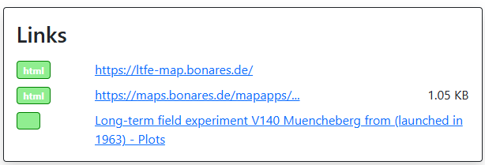

### Architecture
#### Technological Stack

|Technology|Description|
|----------|-----------|
|**Python**|Used for the linkchecker integration, API development, and database interactions.|
|**[PostgreSQL](https://www.postgresql.org/)**|Primary database for storing and managing link information.|
|**[FastAPI](https://fastapi.tiangolo.com/)**|Employed to create and expose REST API endpoints. Utilizes FastAPI's efficiency and auto-generated [Swagger](https://swagger.io/docs/specification/2-0/what-is-swagger/) documentation.|
|**Docker**|Used for containerizing the application, ensuring consistent deployment across environments.|
|**CI/CD**|Automated pipeline for continuous integration and deployment, with scheduled weekly runs for link liveliness assessment.|

#### Main Component Diagram

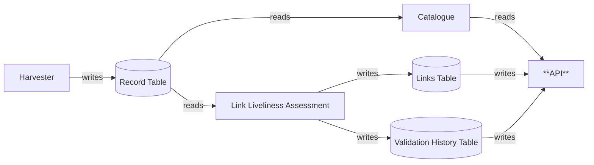
```mermaid
flowchart LR
    H["Harvester"]-- "writes" -->MR[("Record Table")]
    MR-- "reads" -->LAA["Link Liveliness Assessment"]
    MR-- "reads" -->CA["Catalogue"]
    LAA-- "writes" -->LLAL[("Links Table")]
    LAA-- "writes" -->LLAVH[("Validation History Table")]
    CA-- "reads" -->API["**API**"]
    LLAL-- "writes" -->API
    LLAVH-- "writes" -->API
```

#### Main Sequence Diagram

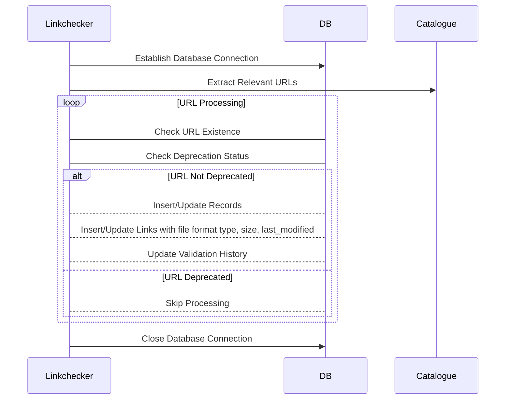
```mermaid
sequenceDiagram
    participant Linkchecker
    participant DB
    participant Catalogue
    
    Linkchecker->>DB: Establish Database Connection
    Linkchecker->>Catalogue: Extract Relevant URLs
    
    loop URL Processing
        Linkchecker->DB: Check URL Existence
        Linkchecker->DB: Check Deprecation Status
        
        alt URL Not Deprecated
            Linkchecker-->DB: Insert/Update Records
            Linkchecker-->DB: Insert/Update Links with file format type, size, last_modified
            Linkchecker-->DB: Update Validation History
        else URL Deprecated
            Linkchecker-->DB: Skip Processing
        end
    end
    
    Linkchecker->>DB: Close Database Connection

```

#### Database Design

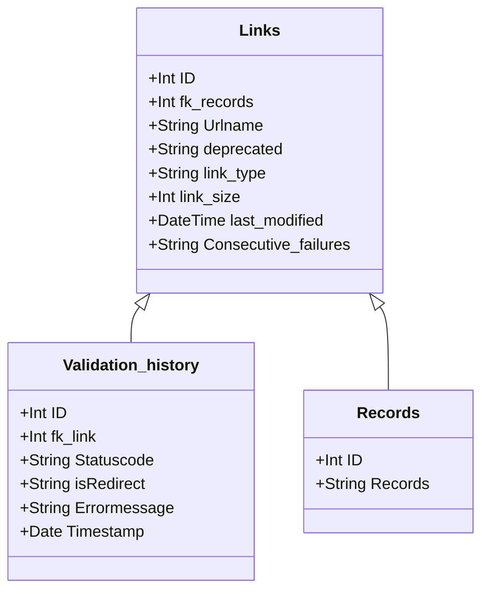
```mermaid
classDiagram
    Links <|-- Validation_history
    Links <|-- Records
    Links : +Int ID
    Links : +Int fk_records
    Links : +String Urlname
    Links : +String deprecated
    Links : +String link_type
    Links : +Int link_size
    Links : +DateTime last_modified
    Links : +String Consecutive_failures
    class Records{
    +Int ID
    +String Records
    }
    class Validation_history{
      +Int ID
      +Int fk_link
      +String Statuscode
     +String isRedirect
     +String Errormessage
     +Date Timestamp
    }
```

### Integrations & Interfaces

-	Visualisation of evaluation in the [SoilWise Finder](catalogue.md), the assessment report is retrieved using ajax from the each record page
- FastAPI now incorporates additional metadata for links, including file format type, size, and last modified date.

### Key Architectural Decisions

Initially we started with [linkchecker](https://pypi.org/project/LinkChecker/) library, but performance was really slow, because it tested the same links for each page again and again.
We decided to only test the links section of ogc-api:records, it means that links within for example metadata abstract are no longer tested.
OGC OWS services are a substantial portion of links, these services return error 500, if called without parameters. For this scenario we created a dedicated script.
If tests for a resource fail a number of times, the resource is no longer tested, and the resource tagged as `deprecated`.
Links via a facade, such as DOI, are followed to the page they are referring to. It means the LLA tool can understand the relation between DOI and the page it refers to.
For each link it is known on which record(s) it is mentioned, so if a broken link occurs, we can find a contact to notify in the record.

For the second release we have enhanced the link liveliness assement tool to collect more information about the resources:

  - **File type format** (media type) to help users understand what format they'll be accessing (e.g., image/jpeg, application/pdf, text/html)
  - **File size** to inform users about download expectations
  - **Last modification date** to indicate how recent the resource is

**API Updates:**
The API has been extended to include the newly tracked metadata fields:

- **link_type**: Shows the file format type of the resource (e.g., image/jpeg, application/pdf)
- **link_size**: Indicates the size of the resource in bytes
- **last_modified**: Provides the timestamp when the resource was modified

**New Endpoint:**
- POST **/check-url**: On-demand URL validation endpoint that accepts a URL and optional check_ogc_capabilities parameter.
  Returns real-time validation results without database storage, including diagnostic messages to help users understand link issues.

### Risks & Limitations

## Spatial Metadata Extractor

!!! component-header "Info"
    **Current version:** 0.3.0

    **Technology:** Python 

    **Release:** TBD

    **Project repository:** [Spatial Metadata Extractor](https://github.com/soilwise-he/metadata-augmentation/tree/spatial-metadata-extractor/spatial-metadata-extractor)


### Overview and Scope

The Spatial Metadata Extractor component identifies and extracts location information from metadata records using multiple approaches:

1. **OGC Services Spatial Metadata:** Queries OGC services (WMS, WFS, WCS, CSW) if present in metadata links to extract spatial extent and coverage information, providing a robust method for spatial metadata augmentation. This is done in the [Link Liveliness Assessment component](#link-liveliness-assessment).

2. **Named Entity Recognition (NER):** Extracts location entities from metadata titles and abstracts using a trained spaCy model. The component identifies location references in plain text present in the title and abstract, which are then stored as augmentations in the database. This enables spatial discovery and filtering of datasets within the SWC catalogue.
The component leverages a trained spaCy model specifically configured to recognize location entities labeled as `Location_positive`, ensuring high precision in spatial metadata extraction via the NER approach.

### Key Features
The Spatial Metadata Extractor component privides the following functions:

1. **Detection of OGC service:** Automatically identifies if there are URL's present in the metadata that refers an OGC service and, if so, extracts the bounding box from the metadata of this service.
2. **Location Entity Extraction:** Automatically identifies location mentions in metadata titles and abstracts using a trained spaCy NER model.


### Architecture

#### Technological Stack

|Technology|Description|
|----------|-----------|
|**Python**|Core language for NER pipeline implementation and database interactions.|
|**[spaCy](https://spacy.io/)**|Industrial-strength NLP library used for the trained NER model and entity extraction.|
|**[PostgreSQL](https://www.postgresql.org/)**|Primary database for storing and managing information.|
| **[GDAL](https://gdal.org/)** | Geospatial data abstraction library used for OGC standards augmentation, enabling extraction of bounding box of online geospatial data across formats and services (e.g. WMS, WFS, GML, GeoJSON). 

#### Main Sequence Diagram

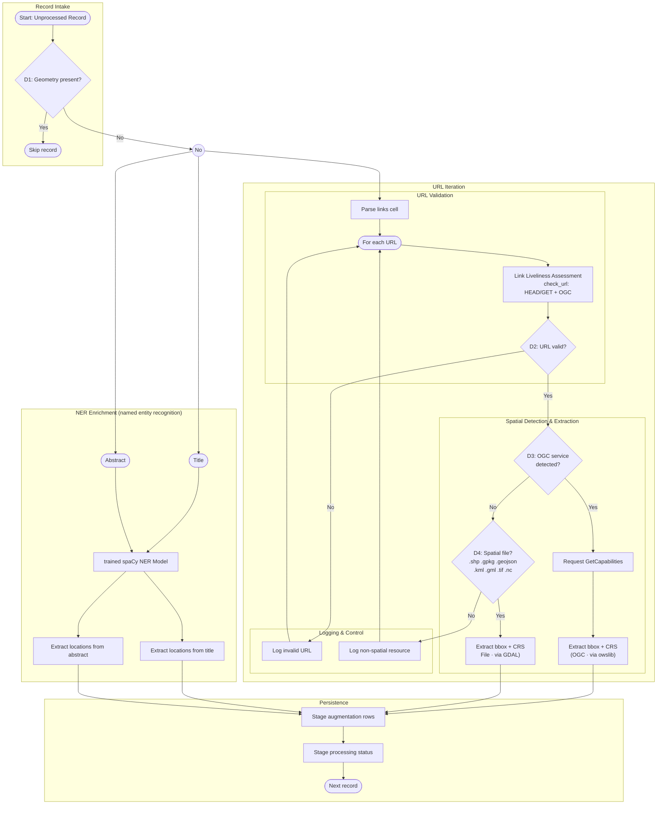
```mermaid
flowchart TD

    %% =====================================================
    %% Swimlane: Record Intake
    %% =====================================================
    subgraph L1[Record Intake]
        A([Start: Unprocessed Record])
        D1{D1: Geometry present?}
        S1([Skip record])
    end

    N((No))

    %% =====================================================
    %% Swimlane: URL Iteration
    %% =====================================================
    subgraph L0[URL Iteration]

        subgraph L2[URL Validation]
            B[Parse links cell]
            C([For each URL])
            LL[Link Liveliness Assessment
            check_url: HEAD/GET + OGC]
            D2{D2: URL valid?}
        end

        subgraph L3[Spatial Detection & Extraction]
            D3{D3: OGC service
            detected?}
            GC[Request GetCapabilities]
            EOGC["Extract bbox + CRS
            (OGC · via owslib)"]
            D4{D4: Spatial file?
            .shp .gpkg .geojson
            .kml .gml .tif .nc}
            EGDAL["Extract bbox + CRS
            File · via GDAL)"]
        end

        subgraph L5[Logging & Control]
            L21[Log invalid URL]
            L22[Log non-spatial resource]
        end

    end

    %% =====================================================
    %% Swimlane: NER Enrichment (Parallel)
    %% =====================================================
    subgraph L4["NER Enrichment (named entity recognition)"]
        N1([Title])
        N2([Abstract])
        N3[trained spaCy NER Model]
        N4[Extract locations from title]
        N5[Extract locations from abstract]
    end

    %% =====================================================
    %% Swimlane: Persistence
    %% =====================================================
    subgraph L6[Persistence]
        K[Stage augmentation rows]
        L[Stage processing status]
        M([Next record])
    end

    %% =====================================================
    %% Main control flow
    %% =====================================================
    A --> D1
    D1 -- Yes --> S1
    D1 -- No --> N --> B

    %% =====================================================
    %% URL loop
    %% =====================================================
    B --> C --> LL --> D2
    D2 -- No --> L21 --> C
    D2 -- Yes --> D3

    D3 -- Yes --> GC --> EOGC --> K
    D3 -- No --> D4
    D4 -- Yes --> EGDAL --> K
    D4 -- No --> L22 --> C

    %% =====================================================
    %% NER parallel branch
    %% =====================================================
    N --> N1 --> N3 --> N4
    N --> N2 --> N3 --> N5

    %% =====================================================
    %% Join point after URL loop + NER
    %% =====================================================
    N4 --> K
    N5 --> K

    K --> L --> M
```

#### Database Design {#sme-database-design}

The Spatial Metadata Extractor uses the following database structure in the NER pipeline:

- **metadata.records:** Source table containing identifier, title, and abstract fields
- **metadata.augments:** Stores extracted location entities with fields:
    - `record_id`: Link to the source record
    - `property`: Metadata field (e.g., 'title', 'abstract')
    - `value`: JSON-formatted location data containing text, start_char, and end_char
    - `process`: Set to 'NER-augmentation'
- **metadata.augment_status:** Tracks processing status with fields:
    - `record_id`: Link to the source record
    - `status`: Processing status (e.g., 'processed')
    - `process`: Set to 'NER-augmentation'

    Example augmentation value:
    ```json
    [
    {"text": "Rostock", "start_char": 45, "end_char": 52},
    {"text": "Germany", "start_char": 120, "end_char": 127}
    ]
    ```

The Spatial Metadata Extractor uses the following database structure in the spatial dataset pipeline:

-> The output is written to a JSONL file where each record consists of the following properties:

- `identifier`: Link to the source record
- `url`: The URL that was processed
- `process`: Set to `'spatial-extractor'`
- `date`: Processing timestamp
- `error`: Error message if extraction failed, otherwise `null`
- `metadata`: Extracted spatial data, structure depends on source type:

    | Source | Fields |
    |--------|--------|
    | **Vector** | `type` `driver` `layer_count` `layers[bbox, epsg, geometry_type, attributes]` `features[GeoJSON geometries only]` |
    | **Raster** | `type` `driver` `width` `height` `band_count` `bbox` `pixel_size` `projection` `bands` |
    | **OGC service** | `service_type` `layer_name` `layer_all` `title` `abstract` `bbox` `crs` |

### Integrations & Interfaces
### Key Architectural Decisions

- **Batch Processing:** Records are processed in batches to balance memory usage and database load. Unprocessed records are identified via a LEFT JOIN against the augment_status table.
- **Character-Level Offsets:** Location entities include start and end character positions to possible enable precise highlighting and linking in the catalogue interface.
- **JSON Storage:** Extracted locations are stored as JSON arrays to maintain structured data while allowing flexible querying and display options.
- **Configurable Model Path:** The model path can be specified via environment variable (`MODEL_PATH`) or command-line argument, allowing flexibility for different updates of the trained models.

### Risks & Limitations

- **Model Dependency:** Performance and accuracy depend entirely on the quality and training data of the spaCy NER model.
- **Entity Label Specificity:** the model is trained on a set of entity keywords and then finetuned based on location data already present in the catalogue.
- **Abstract And Title Processing:** Extraction may fail on malformed abstracts/titles, with errors logged and processing continuing to the next record.
- **Database Performance:** Large batch operations may impact database performance; batch size may need tuning based on system capacity.

## Foreseen functionality

In the next iterations, Metadata augmentation component is foreseen to include the following additional functions:

### Keyword extraction

The value of relevant keywords is often underestimated by data producers. This proof-of-concept module evaluates the metadata title/abstract to identify relevant keywords using NLP/NER technology. Integration with the [catalogue](./catalogue.md) is foreseen.

### Spatial scope analyser

A module that is foreseen to analyse the spatial scope of a resource.

The bounding box will be matched to country or continental bounding boxes using a gazeteer.

To understand if the dataset has a global, continental, national or regional scope

- Retrieves all datasets (as iso19139 xml) from database (records table joined with augmentations) which:
    - have a bounding box 
    - no spatial scope
    - in iso19139 format
- For each record it compares the boundingbox to country bounding boxes: 
    - if bigger then continents > global
    - If matches a continent > continental
    - if matches a country > national
    - if smaller > regional
- result is written to as an augmentation in a dedicated table

### EUSO-high-value dataset tagging

The EUSO high-value datasets are those with substantial potential to assess soil health status, as detailed on the [EUSO dashboard](https://esdac.jrc.ec.europa.eu/esdacviewer/euso-dashboard/). This framework includes the concept of [soil degradation indicator](https://esdac.jrc.ec.europa.eu/content/soil-degradation-indicators-eu) metadata-based identification and tagging. Each dataset (possibly only those with the supra-national spatial scope - under discussion) will be annotated with a potential soil degradation indicator for which it might be utilised. Users can then filter these datasets according to their specific needs. 

The EUSO soil degradation indicators employ specific [methodologies and thresholds](https://esdac.jrc.ec.europa.eu/euso/euso-dashboard-sources) to determine soil health status, see also the Table below. These methodologies will also be considered, as they may have an impact on the defined thresholds. This issue will be examined in greater detail in the future.

<table>
  <tr>
    <th>Soil Degradation</th>
    <th>Soil Indicator</th>
    <th>Type of methodic for threshold</th>
  </tr>
  <tr>
    <td rowspan="5" style="text-align: center; vertical-align: middle; font-weight: bold;">Soil erosion</td>
    <td>Water erosion</td>
    <td>RUSLE2015</td>
  </tr>
  <tr>
    <td>Wind erosion</td>
    <td>GIS-RWEQ</td>
  </tr>
  <tr>
    <td>Tillage erosion</td>
    <td>SEDEM</td>
  </tr>
  <tr>
    <td>Harvest erosion</td>
    <td>Textural index</td>
  </tr>
  <tr>
    <td>Post-fire recovery</td>
    <td>USLE (Type of RUSLE)</td>
  </tr>
  <tr>
    <td rowspan="5" style="text-align: center; vertical-align: middle; font-weight: bold;">Soil pollution</td>
    <td>Arsenic excess</td>
    <td>GAMLSS-RF</td>
  </tr>
  <tr>
    <td>Copper excess</td>
    <td>GLM and GPR</td>
  </tr>
  <tr>
    <td>Mercury excess</td>
    <td>LUCAS topsoil database</td>
  </tr>
  <tr>
    <td>Zinc Excess</td>
    <td>LUCAS topsoil database</td>
  </tr>
  <tr>
    <td>Cadmium Excess</td>
    <td>GEMAS</td>
  </tr>
  <tr>
    <td rowspan="3" style="text-align: center; vertical-align: middle; font-weight: bold;">Soil nutrients</td>
    <td>Nitrogen surplus</td>
    <td>NNB</td>
  </tr>
  <tr>
    <td>Phosphorus deficiency</td>
    <td>LUCAS topsoil database</td>
  </tr>
  <tr>
    <td>Phosphorus excess</td>
    <td>LUCAS topsoil database</td>
  </tr>
  <tr>
    <td style="text-align: center; vertical-align: middle; font-weight: bold;">Loss of soil organic carbon</td>
    <td>Distance to maximum SOC level</td>
    <td>qGAM</td>
  </tr>
  <tr>
    <td style="text-align: center; vertical-align: middle; font-weight: bold;">Loss of soil biodiversity</td>
    <td>Potential threat to biological functions</td>
    <td>Expert Polling, Questionnaire, Data Collection, Normalization and Analysis</td>
  </tr>
  <tr>
    <td style="text-align: center; vertical-align: middle; font-weight: bold;">Soil compaction</td>
    <td>Packing density</td>
    <td>Calculation of Packing Density (PD)</td>
  </tr>
  <tr>
    <td style="text-align: center; vertical-align: middle; font-weight: bold;">Salinization</td>
    <td>Secondary salinization</td>
    <td>-</td>
  </tr>
  <tr>
    <td style="text-align: center; vertical-align: middle; font-weight: bold;">Loss of organic soils</td>
    <td>Peatland degradation</td>
    <td>-</td>
  </tr>
  <tr>
    <td style="text-align: center; vertical-align: middle; font-weight: bold;">Soil consumption</td>
    <td>Soil sealing</td>
    <td>Raster remote sense data</td>
  </tr>
</table>

Technically, we forsee the metadata tagging process as illustrated below. At first, metadata record's title, abstract and keywords will be checked for the occurence of specific **values from the Soil Indicator and Soil Degradation Codelists**, such as `Water erosion` or `Soil erosion` (see the Table above). If found, the `Soil Degradation Indicator Tag` (corresponding value from the Soil Degradation Codelist) will be displayed to indicate suitability of given dataset for soil indicator related analyses. Additionally, a search for corresponding **methodology** will be conducted to see if the dataset is compliant with the EUSO Soil Health indicators presented in the [EUSO Dashboard](https://esdac.jrc.ec.europa.eu/esdacviewer/euso-dashboard/). If found, the tag `EUSO High-value dataset` will be added. In later phase we assume search for references to Scientific Methodology papers in metadata record's links. Next, the possibility of involving a more complex search using soil thesauri will also be explored.


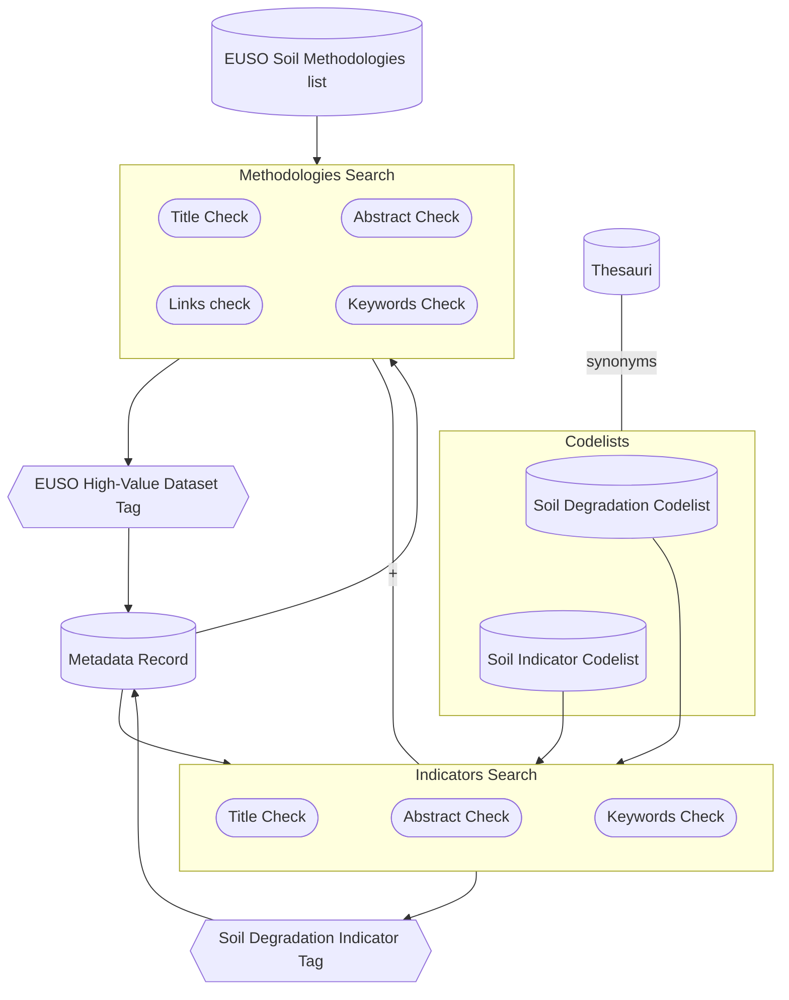
``` mermaid
flowchart TD
    subgraph ic[Indicators Search]
        ti([Title Check]) ~~~ ai([Abstract Check])
        ai ~~~ ki([Keywords Check])
    end
    subgraph Codelists
        sd ~~~ si
    end
    subgraph M[Methodologies Search]
        tiM([Title Check]) ~~~ aiM([Abstract Check])
        kl([Links check]) ~~~ kM([Keywords Check])
    end
    m[(Metadata Record)] --> ic
    m --> M
    ic-- + ---M
    sd[(Soil Degradation Codelist)] --> ic
    si[(Soil Indicator Codelist)] --> ic
    em[(EUSO Soil Methodologies list)] --> M
    M --> et{{EUSO High-Value Dataset Tag}}
    et --> m
    ic --> es{{Soil Degradation Indicator Tag}}
    es --> m
    th[(Thesauri)]-- synonyms ---Codelists
```

### Translation module

Some records arrive in a local language, SWR will translate the main properties for the record: title and abstract into English, to offer a single language user experience. 

The translation module will build on the EU translation service (API documentation at <https://language-tools.ec.europa.eu/>). 

The EU translation returns asynchronous responses to translation requests, this means that translations may not yet be available after initial load of new data. A callback operation populates the database, from that moment a translation is available to SWR. The translation service uses 2-letter language codes, it means a translation from a 3-letter iso code (as used in for example iso19139:2007) to 2-letter code is required. The EU translation service has a limited set of translations from a certain to alternative language available, else returns an error.

Initial translation will be triggered by a running harvester. The translations will then be available once the record is ingested to the triplestore and catalogue database in a followup step of the harvester. 

<!-- 
### Architecture
#### Technological Stack
|Technology|Description|
|----------|-----------|
|**Python**|Used for the translation module, API development, and database interactions.|
|**[PostgreSQL](https://www.postgresql.org/)**|Primary database for storing and managing information.|
|**[FastAPI](https://fastapi.tiangolo.com/)**|Employed to create and expose REST API endpoints. Utilizes FastAPI's efficiency and auto-generated [Swagger](https://swagger.io/docs/specification/2-0/what-is-swagger/) documentation.|
|**Docker**|Used for containerizing the application, ensuring consistent deployment across environments.|
|**CI/CD**|Automated pipeline for continuous integration and deployment, with scheduled dayly runs.|
-->