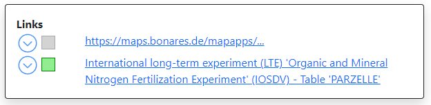

# Metadata Validation

> Metadata should help users assess the usability of a data set for their own purposes and help users to understand their quality.

In terms of metadata, SoilWise Repository aims for the approach to harvest and register as much as possible (see more information in the [Harvester Component](ingestion.md)). Catalogues which capture metadata authored by data custodians typically have a wide range of metadata completion and accuracy. Therefore, the SoilWise Repository employs metadata validation mechanisms to provide additional information about metadata completeness, conformance and integrity. Information resulting from the validation process are stored together with each metadata record in a relation database and updated after registering a new metadata version. Within the first iteration, they are not displayed in the [SoilWise Catalogue](catalogue.md), except of the results of the [Link liveliness assessment](#link-liveliness-assessment) component. For the following iterations, we forsee the validation results to be available only to data / knowledge owners / managers and the SWR admins, as SoilWise is not in an arbiter's role.

After [Metadata augmentation](metadata_augmentation.md), the whole validation process can be repeated to understand the variability of metadata and value which has been added by SWR.

Validations:

- [Metadata profile validation](#metadata-profile-validation)
- [Link liveliness assessment](#link-liveliness-assessment )

## Metadata profiles

Metadata profiles specify the required metadata elements that must be included to describe resources, ensuring they are discoverable, accessible, and usable. Metadata validation is inherently linked to the specific metadata profile it is intended to follow. This linkage ensures that metadata records are consistent, meet the necessary standards, and are fit for their intended purpose, thereby supporting effective data management, discovery, and use. In the soil domain, several metadata profiles are commonly used to ensure the effective documentation, discovery, and utilization of soil data, for example Datacite, GBIF-EML, Geo-DCAT-AP, INSPIRE Metadata Profile, Dublin Core, ANZLIC Metadata Profile, FAO Global Soil Partnership Metadata Profile, EJP/EUSO Metadata Profile. SoilWise Repository is currently able to perform validations according to the following metadata profiles:

<!--
### Minimal metadata elements

A minimal set of metadata elements was defined to validate completeness of metadata record against the optimal performace prerequisites of SWR platform.

| Label | Description |
| ---   | ---         |
| Identification | Unique identification of the dataset (A UUID, URN, or URI, such as DOI) |
| Title | Short meaningful title |
| Abstract | Short description or abstract (1/2 page), can include (multiple) scientific/technical references |
| Contributor | An entity responsible for making contributions to the content of the resource (e.g. person or organisation name) |
| Date | Last update date | 
| Type | The nature or genre of the content of the resource |
| Rights | Information about rights and licences |
| Extent (geographic) | Geographical coverage (e.g. EU, EU & Balkan, France, Wallonia, Berlin) |
| Online source | Location (address) for online access from which the resource can be obtained |
-->

### EUSO Metadata profile 

This metadata profile was developed through EJP Soil project efforts and modified and approved by the EUSO Working Group.

This metadata profile has been used within the first development iteration phase. Its further modification are under discussions among all the stakeholders.

| Label | Cardinality | Codelist | Description |
| ---   | ---         | ---      | ---         |
| Identification | 1-n | | Unique identification of the dataset (A UUID, URN, or URI, such as DOI) |
| Title | 1-1 | | Short meaningful title |
| Abstract | 1-1 | | Short description or abstract (1/2 page), can include (multiple) scientific/technical references |
| Extent (geographic) | 0-1 | BBOX or Geonames | Geographical coverage (e.g. EU, EU & Balkan, France, Wallonia, Berlin) |
| Reference period - Start | 0-1 | | Reference period for the data - Start |
| Reference period - End | 0-1 | | Reference period - End; empty if ongoing |
| Access constraints | 1-1 | INSPIRE | Indicates if the data is publicly accessible or the reason to apply access constaints |
| Usage constraints | 1-1 | INSPIRE | Indicates if there are legal usage constraints (license) |
| Keywords | 0-n |  | Keywords |
| Contact  | 1-n |  | name; organisation; email; role, where role is one of distributor, owner, pointOfContact, processor, publisher, metadata-contact |
| Source   | 0-n |  | Source is a reference to another dataset which is used as a source for this dataset. Reference a single dataset per line; Title; Date; or provide a DOI; |
| isSourceOf | 0-n |  | Other datasets that the current dataset is used as input source |
| Lineage  | 1-1 |  | Statement on the origin and processing of the data |
| Processing steps | 0-n |  | Methods applied in data acquisition and processing: preferably reference a method from a standard (national, LUCAS, FAO, etc.). One processing step per line; Method; Date; Processor; Method reference; Comment |
| Language | 1-n | ISO | Language, of the data and metadata, if metadata is multilingual multiple languages can be provided |
| Reference system | 0-1 | CRS | Spatial Projection: drop down list of options, including ‘unknown’  (you can also leave out the field if it is unknown) |
| Citation | 0-n |  | Citations are references to articles which reference this dataset; one citation on each line; Title; Authors; Date; or provide a DOI |
| Spatial resolution | 0-n |  | Resolution (grid) or scale (vector) |
| Data type | 0-1 | table, vector, grid | The type of data |
| Geometry type | 0-1 | point, line, polygon, ... | Geometry type for vector data |
| File / service Location | 0-n |   | Url or path to the data file or service |
| Format | 0-n | IANA | File Format in which the data is maintained or published |
| Delivery | 0-n |  | The  way the dataset is available (ie digital: download, viewer OR physical way: Shipping or in situ access )  |
| Maintenenance frequency | 0-1 | ISO | Indication of the frequency of data updates |
| Modification date | 0-1 |  | Date of last modification |
| Status | 0-1 | ISO | Status of the dataset |
| Subject - Spatial scope | 0-n | INSPIRE | The scope of the dataset, e.g. regional, national, continental |
| Subject - Soil properties | 0-n | INSPIRE | Soil properties described in this dataset |
| Subject - Soil function | 0-n | INSPIRE  | Soil funtions described in this dataset |
| Subject - Soil threats | 0-n | INSPIRE | Soil threats described in this dataset |
| Subject - Soil Indicators | 0-n | INSPIRE | Soil indicators  described in this dataset |
| Subject - EUSO Data WG subgroup | 0-n | EUSO | The EUSO subgroups which contributed to this record |
| Subject - Context | 0-n | EUSO | Context: (e.g. EU-Project SOILCARE, EJP-Soil, Literature, ESDAC, etc.) |
| Subject - Possible End-users | 0-n | EUSO | Possible end-users: citizens, scientific community, private sector, EU, member states, academia |
| Subject - Category | 0-n | EUSO | One or more thematic categories of the dataset |
| Quality statement | 0-1 | | A statement of quality or any other supplemental information |
| Datamodel/dimensions | 0-1 | | The datamodel (table) or dimensions (grid) of the dataset |
| Units of measure | 0-n | ISU | List of UoM from International System of Units, at attribute/dimension level |
| Attribute type | 0-n | string, number, date | The type of attribute |
| Categorical Data | 0-n |  | Lookup tables for categorical data, at attribute/dimension level |
| Uncertainty | 0-n |  | Method used to assess uncertainty and its result. For example: One or more measurements to describe the error and uncertainties in the dataset |
| Completeness | 0-1 |  | The % of completeness |

### INSPIRE metadata profile

The validation against the INSPIRE metadata profile checks whether the metadata records are in accordance with the technical requirements of INSPIRE, specifically according to the [INSPIRE data specification on Soil – Technical Guidelines](https://inspire-mif.github.io/technical-guidelines/data/so/dataspecification_so.pdf) version 3.0. The Soil-specific metadata elements are: 

| Type                                  | Package Stereotypes |
|---------------------------------------|---------------------|
| DerivedProfilePresenceInSoilBody      | «associationType»   |
| DerivedSoilProfile                    | «featureType»       |
| FAOHorizonMasterValue                 | «codelist»          |
| FAOHorizonNotationType                | «dataType»          |
| FAOHorizonSubordinateValue            | «codelist»          |
| FAOPrimeValue                         | «codelist»          |
| LayerGenesisProcessStateValue         | «codelist»          |
| LayerTypeValue                        | «codelist»          |
| ObservedSoilProfile                   | «featureType»       |
| OtherHorizonNotationType              | «dataType»          |
| OtherHorizonNotationTypeValue         | «codelist»          |
| OtherSoilNameType                     | «dataType»          |
| OtherSoilNameTypeValue                | «codelist»          |
| ParticleSizeFractionType              | «dataType»          |
| ProfileElement                        | «featureType»       |
| ProfileElementParameterNameValue      | «codelist»          |
| RangeType                             | «dataType»          |
| SoilBody                              | «featureType»       |
| SoilDerivedObject                     | «featureType»       |
| SoilDerivedObjectParameterNameValue   | «codelist»          |
| SoilHorizon                           | «featureType»       |
| SoilInvestigationPurposeValue         | «codelist»          |
| SoilLayer                             | «featureType»       |
| SoilPlot                              | «featureType»       |
| SoilPlotTypeValue                     | «codelist»          |
| SoilProfile                           | «featureType»       |
| SoilProfileParameterNameValue         | «codelist»          |
| SoilSite                              | «featureType»       |
| SoilSiteParameterNameValue            | «codelist»          |
| SoilThemeCoverage                     | «featureType»       |
| SoilThemeDescriptiveCoverage          | «featureType»       |
| SoilThemeDescriptiveParameterType     | «dataType»          |
| SoilThemeParameterType                | «dataType»          |
| WRBQualifierGroupType                 | «dataType»          |
| WRBQualifierPlaceValue                | «codelist»          |
| WRBQualifierValue                     | «codelist»          |
| WRBReferenceSoilGroupValue            | «codelist»          |
| WRBSoilNameType                       | «dataType»          |
| WRBSpecifierValue                     | «codelist»          |

## Functionality

### Metadata profile validation

!!! component-header "Info"
    **Current version:** 1.0

    **Project:** [Metadata validator](https://github.com/soilwise-he/metadata-validator)

    **Access point:** <https://data.soilwise.wetransform.eu/#/home> (authorization needed)

#### Metadata structure validation

The initial steps of metadata validation comprise:

1. **Syntax Check:** Verifying that the metadata adheres to the specified syntax rules. This includes checking for allowed tags, correct data types, character encoding, and adherence to naming conventions.
2. **Schema (DTD/xsd/shacl/json-schema) Validation:** Ensuring that the metadata conforms to the defined schema or metadata model. This involves verifying that all required elements are present, and relationships between different metadata components are correctly established.

#### Metadata completeness indication

The indication calculates a level of completeness of a record, indicated in % of 100 for endorsed properties of the EUSO soil profile, considering that some properties are conditional based on selected values in other properties.

#### Metadata ETS/ATS checking

The methodology of ETS/ATS has been suggested to develop validation tests.

**Abstract Executable Test Suites (ATS)** define a set of abstract test cases or scenarios that describe the expected behaviour of metadata without specifying the implementation details. These test suites focus on the logical aspects of metadata validation and provide a high-level view of metadata validation requirements, enabling stakeholders to understand validation objectives and constraints without getting bogged down in technical details. They serve as a valuable communication and documentation tool, facilitating collaboration between metadata producers, consumers, and validators. ATS are often documented using natural language descriptions, diagrams, or formal specifications. They outline the expected inputs, outputs, and behaviours of the metadata under various conditions.

**Executable Test Suites (ETS)** are sets of tests designed according to ATS to perform the metadata validation. These tests are typically automated and can be run repeatedly to ensure consistent validation results. Executable test suites consist of scripts, programs, or software tools that perform various validation checks on metadata. These checks can include:

1. **Data Integrity:** Checking for inconsistencies or errors within the metadata. This includes identifying missing values, conflicting information, or data that does not align with predefined constraints.
2. **Standard Compliance:** Assessing whether the metadata complies with relevant industry standards, such as Dublin Core, MARC, or specific domain standards like those for scientific data or library cataloguing.
3. **Interoperability:** Evaluating the metadata's ability to interoperate with other systems or datasets. This involves ensuring that metadata elements are mapped correctly to facilitate data exchange and integration across different platforms.
4. **Versioning and Evolution:** Considering the evolution of metadata over time and ensuring that the validation process accommodates versioning requirements. This may involve tracking changes, backward compatibility, and migration strategies.
5. **Quality Assurance:** Assessing the overall quality of the metadata, including its accuracy, consistency, completeness, and relevance to the underlying data or information resources.
6. **Documentation:** Documenting the validation process itself, including any errors encountered, corrective actions taken, and recommendations for improving metadata quality in the future.

#### Technology & Integration

[hale»connect](https://wetransform.to/haleconnect/){target=_blank} has been deployed. This platform includes the European Testing Framework ETF and can execute Metadata and Data validation usign the ETS approach outlined above. The User Guide is available [here](https://help.wetransform.to/docs/getting-started/2018-04-28-quick-start){target=_blank}. The administration console of the platform can be accessed upon login at: <https://data.soilwise.wetransform.eu/#/home>.

The metadata validation component will show its full potential when integrated to (1) [SWR Catalogue](catalogue.md), (2) [Storage of metadata](storage.md#storage-of-metadata), and (3) Requires [authentication](user_management.md#authentication) and [authorisation](user_management.md#authorisation).

#### User Guide

When using the ‘Metadata only’ workflow, the metadata profile can be validated with hale»connect.
To do this, after logging into hale»connect, go directly to the setup of a new Theme (transformation project and Schema are therefore not required) and activate ‘Publish metadata only’ and specify where the metadata should come from. To validate the metadata file, upload the metadata and select ‘Metadata only’. Once validation is complete, a report can be called up.

A comprehensive tutorial video on setting up and executing transformation workflows can be found [here](https://www.youtube.com/watch?v=U1lxzlUquE8&list=PLoyBfgUelhNOwA_GGkd4hSwDnwNhxGC87&index=3){target=_blank}.

#### Future work

- full development of the ETS, using populated codelists,
- display validation results in the SoilWise Catalogue,
- on-demand metadata validation, which would generate reports for user-uploaded metadata,
- applicability of [ISO19157 Geographic Information – Data quality](https://www.iso.org/standard/78900.html) (i.e. the standard intended for data validations) for metadata-based validation reports,
- [Shacl](https://www.w3.org/TR/shacl/){target=_blank} is is in general intended for semantic web related validations; however, it's exact scope will be determined during the upcoming SoilWise developments. 

### Link liveliness assessment 

!!! component-header "Info"
    **Current version:** 1.0

    **Projects:** [Link liveliness assessment](https://github.com/soilwise-he/link-liveliness-assessment)

Metadata (and data and knowledge sources) tend to contain links to other resources. Not all of these URIs are persistent, so over time they can degrade. In practice, many non-persistent knowledge sources and assets exist that could be relevant for SWR, e.g. on project websites, in online databases, on the computers of researchers, etc. Links pointing to such assets might however be part of harvested metadata records or data and content that is stored in the SWR. 

The link liveliness assessment subcomponent runs over the available links stored with the SWR assets and checks their status. The function is foreseen to run frequently over the URIs in the SWR repository, assessing and storing the status of the link. The link liveliness  privides the following functions:

1. **OGC API Catalogue Integration**
    - Designed to work specifically with [OGC API - Records](https://ogcapi.ogc.org/records/){target=_blank} System
    - Extracts and evaluates URLs from catalogue items 
2. **Link Validation**
    - Evaluates the validity of links to external sources and within the repository
    - Checks if metadata accurately represents the source
3. **Support for OGC service links**
    - Identifies and properly handles OGC service links ([WMS](https://www.ogc.org/standard/wms/){target=_blank}, [WFS](https://www.ogc.org/standard/wfs/){target=_blank}, [CSW](https://www.ogc.org/standard/cat/){target=_blank}, [WCS](https://www.ogc.org/standard/wcs/){target=_blank} etc.) before assessing them
4. **Health Status Tracking**
    - Provides up-to-date status history for every assessed link
    - Maintains a history of link health over time
4. **Flexible Evaluation**
    - Supports single resource evaluation on demand
    - Performs periodic tests to provide availability history
4. **Broken link management**
    - Identifies and categorizes broken links based on their status code ( `401 Unauthorized`, `404 Not Found`, `500 Server Error`)
    - Flags deprecated links after consecutive failed tests and excludes them from future check
5. **Timeout management**
    - Identifies resources exceeding specified timeout thresholds

A javascript widget is further used to display the link status directly in the [SWR Catalogue](catalogue.md) record.

#### Technology
   * **Python**
        Used for the linkchecker integration, API development, and database interactions
   * **[PostgreSQL](https://www.postgresql.org/){target=_blank}**
        Primary database for storing and managing link information
   * **[FastAPI](https://fastapi.tiangolo.com/){target=_blank}**
        Employed to create and expose REST API endpoints. 
        Utilizes FastAPI's efficiency and auto-generated [Swagger](https://swagger.io/docs/specification/2-0/what-is-swagger/){target=_blank} documentation
   * **Docker** 
        Used for containerizing the application, ensuring consistent deployment across environments
   * **CI/CD**
        Automated pipeline for continuous integration and deployment, with scheduled weekly runs for link liveliness assessment
